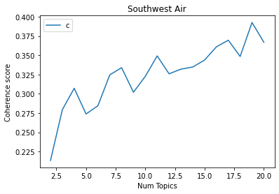

## Introduction
Does tweeting to companies for customer support really work?
Social media is being increasingly used for writing*tweeting* directly to companies to get their queries heard, 
in a fashion which makes it public and a space where everyone and everything is under scrutiny.

- Increasing number of people use twitter to complain about services and companies. A study found that more than one-third of millennials use social media this way Conversocial Report: The State of Social Customer Service.
- In today’s time is it extremely important for a company to solve or respond to customer grievances and lash outs on social media 
before they become bigger issues and affect company reputation. 

## Context


Natural language remains the densest encoding of human experience we have, and innovation in NLP has accelerated to power understanding of that data, but the datasets driving this innovation don't match the real language in use today. The Customer Support on Twitter dataset offers a large corpus of modern English (mostly) conversations between consumers and customer support agents on Twitter, and has three important advantages over other conversational text datasets:

    - <strong>Focused</strong> : Consumers contact customer support to have a specific problem solved, and the manifold of problems to be discussed is relatively small, especially compared to unconstrained conversational datasets like the reddit Corpus.
    - <strong>Natural</strong> : Consumers in this dataset come from a much broader segment than those in the Ubuntu Dialogue Corpus and have much more natural and recent use of typed text than the Cornell Movie Dialogs Corpus.
    - <strong>Succinct</strong> : Twitter's brevity causes more natural responses from support agents (rather than scripted), and to-the-point descriptions of problems and solutions. Also, its convenient in allowing for a relatively low message limit size for recurrent nets.


## Inspiration

The size and breadth of this dataset inspires many interesting questions:

    - Can we predict company responses? Given the bounded set of subjects handled by each company, the answer seems like yes!
    - Do requests get stale? How quickly do the best companies respond, compared to the worst?
    - Can we learn high quality dense embeddings or representations of similarity for topical clustering?
    - How does tone affect the customer support conversation? Does saying sorry help?
    - Can we help companies identify new problems, or ones most affecting their customers?
## Content

The dataset is a CSV, where each row is a tweet. The different columns are described below. Every conversation included has at least one request from a consumer and at least one response from a company. Which user IDs are company user IDs can be calculated using the inbound field.
- <strong>tweet_id</strong> : A unique, anonymized ID for the Tweet. 
Referenced by response_tweet_id and in_response_to_tweet_id.

- <strong> author_id </strong> : A unique, anonymized user ID. @s in the dataset have been replaced with their associated anonymized user ID.

- <strong> ainbound </strong> : Whether the tweet is "inbound" to a company doing customer support on Twitter. This feature is useful when re-organizing data for training conversational models.


- <strong> created_at </strong> :  Date and time when the tweet was sent.
- <strong> text </strong> : Tweet content. Sensitive information like phone numbers and email addresses are replaced with mask values like __email__.
- <strong> response_tweet_id </strong> : IDs of tweets that are responses to this tweet, comma-separated.


- <strong> in_response_to_tweet_id </strong> : ID of the tweet this tweet is in response to, if any. 


#### Link to dataset: https://drive.google.com/file/d/1d56J-HAIBd9PY3pphzz2PrjGm4JFtEOx/view?usp=sharing
```python
from google.colab import drive
drive.mount("/content/drive")
```

    Mounted at /content/drive
    


```python
!pip install pyspellchecker
!pip install fasttext
!pip install langdetect
!pip install texthero
!pip install transformers
!pip install vaderSentiment
!pip install pyLDAvis
!pip install scattertext
```

    


```python

#Python Imports
import re
import string
from collections import Counter
from datetime import datetime
from IPython.display import IFrame
from IPython.core.display import display, HTML
display(HTML("<style>.container { width:98% !important; }</style>"))


#Pandas
import pandas as pd
pd.set_option('display.max_rows', 500)
pd.set_option('display.max_columns',120)

#Seaborn
import seaborn as sns

#Numpy
import numpy as np

#NLTK
import nltk
from nltk.stem import WordNetLemmatizer
nltk.download('wordnet')
nltk.download('stopwords')  
from nltk.corpus import stopwords

#spaCy
import spacy

#Visualization
import matplotlib.pyplot as plt 
import seaborn as sns
import plotly.express as px
import plotly.graph_objects as go
import scattertext as st

#fasttext

import fasttext
from spellchecker import SpellChecker


#LDA Related packages
import langdetect
import texthero as hero
import regex as re
import math
from transformers import pipeline

import gensim
from gensim.utils import simple_preprocess
from gensim import corpora
from gensim.models import LdaModel
from gensim.models.coherencemodel import CoherenceModel

# LDA visualization
import pyLDAvis
import pyLDAvis.gensim  
import matplotlib.pyplot as plt

#Sentiment
from vaderSentiment.vaderSentiment import SentimentIntensityAnalyzer

```


<style>.container { width:98% !important; }</style>


    [nltk_data] Downloading package wordnet to /root/nltk_data...
    [nltk_data]   Unzipping corpora/wordnet.zip.
    [nltk_data] Downloading package stopwords to /root/nltk_data...
    [nltk_data]   Unzipping corpora/stopwords.zip.
    


```python

df = pd.read_csv("/content/drive/Shared drives/NLP/Project/twcs2.csv", low_memory=False)
```

# A. Reformatting Dataframe
- Matching tweet to company
- Splitting tweets into inbound tweets (from customers), company tweets, and customer response tweets.

Here we gather all twitter complaint conversations from 2 tweets (inbound and company response), to 4 tweets (inbound and 3 company responses). We do this because sometimes the company might not respond directly to the inbound tweet, so we save longer twitter conversations in order to have a better chance of labelling each tweet with a company.


```python
#code results in inbound tweet, and 3 responding tweets, as well as companies
df_resp = df[['created_at','tweet_id','author_id','text','in_response_to_tweet_id', 'response_tweet_id']]

# 1. Gathering all inbound tweets(from customers) and all its first responses by merging left.
inbound = df[pd.isnull(df.in_response_to_tweet_id) & df.inbound == True]
inbound = inbound[['created_at','tweet_id','text','response_tweet_id', 'in_response_to_tweet_id']]
df2 = pd.merge(inbound, df_resp, how = 'left', left_on='tweet_id', right_on='in_response_to_tweet_id')
df2 = df2[['created_at_x','text_x', 'tweet_id_y','author_id','created_at_y','text_y']]

# 2. Gathering all responses to the 'first responses'.
df3 = pd.merge(df2, df_resp, how = 'left', left_on='tweet_id_y', right_on='in_response_to_tweet_id')
df3 = df3[['created_at_x', 'text_x','author_id_x', 'created_at_y', 'text_y','created_at','tweet_id', 'author_id_y','text']]
df3.rename(columns={'created_at_x':'inbound_time','text_x': 'inbound_text', 'author_id_x': 'author_1','created_at_y':'resp_1_time', 'text_y' : 'text1',\
                   'author_id_y':'author_2', 'created_at':'resp_2_time', 'text':'text2'}, inplace=True)

# 2b. Since some conversations end within 2 tweets (inbound and response), the third tweet will be null. So we save these 2 tweet
# conversations into a dataframe called first_resp.
first_resp = df3[df3.tweet_id.isnull()]
first_resp.rename(columns = {'author_1': 'company'}, inplace = True)
first_resp = first_resp.iloc[:,:-4]

# 3. Gathering all third responses to second response column.
df3 = df3[df3.tweet_id.notnull()]
df4 = pd.merge(df3, df_resp, how = 'left', left_on='tweet_id', right_on='in_response_to_tweet_id')
df4 = df4[['inbound_time','inbound_text','author_1','resp_1_time', 'text1','resp_2_time',\
           'author_2','text2','created_at', 'tweet_id_y','author_id','text']]
df4.rename(columns = {'author_id': 'author_3', 'text':'text3', 'created_at': 'resp_3_time'},inplace = True)

# 3b. If the conversation ends within 3 tweets (inbound and 2 responses), we will save that to antoher dataframe called 2nd response.
second_resp = df4[df4.tweet_id_y.isnull()]
second_resp = second_resp.iloc[:,:-4]
second_resp['company'] = ''
for count in second_resp.index:
    for i in ['author_1','author_2']:
        if second_resp[i][count].isnumeric() == False:
            second_resp['company'][count] = second_resp[i][count]

# 4. Gathering all fourth responses to third response column.
df4 = df4[df4.tweet_id_y.notnull()]
df5 = pd.merge(df4, df_resp, how = 'left', left_on='tweet_id_y', right_on='in_response_to_tweet_id')
df5 = df5[['inbound_time','inbound_text','author_1','resp_1_time', 'text1','author_2', 'resp_2_time', 'text2','author_3','resp_3_time', 'text3',\
          'author_id','created_at', 'text','tweet_id']]
df5.rename(columns = {'author_id': 'author_4', 'created_at':'resp_4_time', 'text':'text4'},inplace = True)

# 3b. If the conversation ends within 4 tweets (inbound and 3 responses), we will save that to antoher dataframe called 2nd response.
third_resp = df5[df5.tweet_id.isnull()]
third_resp = third_resp.iloc[:,:-4]
third_resp['company'] = ''
for count in third_resp.index:
    for i in ['author_1','author_2','author_3']:
        if third_resp[i][count].isnumeric() == False:
            third_resp['company'][count] = third_resp[i][count]
```

Creating a dataframe with all labelled inbound, company and responding tweets. Labelling each tweet with related company.


```python
# Creating a dataframe with company, text and tweet type.

inbound1 = pd.concat([first_resp[['inbound_time','inbound_text','company']], second_resp[['inbound_time','inbound_text','company']]\
          ,third_resp[['inbound_time','inbound_text','company']]])
inbound1.rename(columns = {'inbound_text':'text', 'inbound_time':'time'}, inplace = True)
inbound1['type'] = 'inbound'

comp_tweet0 = first_resp[['resp_1_time','company','text1']]
comp_tweet0.rename(columns = {'text1':'text', 'resp_1_time':'time'}, inplace = True)

comp_tweet1 = second_resp[second_resp.author_1.apply(lambda x: x.isnumeric()== False)][['resp_1_time','company','text1']]
comp_tweet1.rename(columns = {'text1':'text','resp_1_time':'time'}, inplace = True)
comp_tweet2 = second_resp[second_resp.author_2.apply(lambda x: x.isnumeric()== False)][['resp_2_time','company','text2']]
comp_tweet2.rename(columns = {'text2':'text', 'resp_2_time':'time'}, inplace = True)

comp_tweet3 = third_resp[third_resp.author_1.apply(lambda x: x.isnumeric()== False)][['resp_1_time', 'company','text1']]
comp_tweet3.rename(columns = {'text1':'text', 'resp_1_time':'time'}, inplace = True)
comp_tweet4 = third_resp[third_resp.author_2.apply(lambda x: x.isnumeric()== False)][['resp_2_time', 'company','text2']]
comp_tweet4.rename(columns = {'text2':'text','resp_2_time':'time'}, inplace = True)
comp_tweet5 = third_resp[third_resp.author_3.apply(lambda x: x.isnumeric()== False)][['resp_3_time', 'company','text3']]
comp_tweet5.rename(columns = {'text3':'text', 'resp_3_time':'time'}, inplace = True)

company = pd.concat([comp_tweet0, comp_tweet1, comp_tweet2, comp_tweet3, comp_tweet4, comp_tweet5])
company['type'] = 'company'


resp_tweet1 = second_resp[second_resp.author_1.apply(lambda x: x.isnumeric())][['resp_1_time','company','text1']]
resp_tweet1.rename(columns = {'text1':'text','resp_1_time':'time'}, inplace = True)
resp_tweet2 = second_resp[second_resp.author_2.apply(lambda x: x.isnumeric())][['resp_2_time', 'company','text2']]
resp_tweet2.rename(columns = {'text2':'text','resp_2_time':'time'}, inplace = True)
resp_tweet3 = third_resp[third_resp.author_1.apply(lambda x: x.isnumeric())][['resp_1_time','company','text1']]
resp_tweet3.rename(columns = {'text1':'text','resp_1_time':'time'}, inplace = True)
resp_tweet4 = third_resp[third_resp.author_2.apply(lambda x: x.isnumeric())][['resp_2_time', 'company','text2']]
resp_tweet4.rename(columns = {'text2':'text','resp_2_time':'time'}, inplace = True)
resp_tweet5 = third_resp[third_resp.author_3.apply(lambda x: x.isnumeric())][['resp_3_time', 'company','text3']]
resp_tweet5.rename(columns = {'text3':'text','resp_3_time':'time'}, inplace = True)

responses = pd.concat([resp_tweet1, resp_tweet2, resp_tweet3, resp_tweet4, resp_tweet5])
responses['type'] = 'responses'
```


```python
preprocessed = pd.concat([inbound1, company, responses])
df = preprocessed.copy()
```

Since there may be multiple tweets responding to the initial inbound tweet, there may be multiple of the same inbound tweets included in the dataframe. We will only keep the unique tweets in the dataframe.
- We have a total of 1,929,658 unique tweets.


```python
# Keeping unique tweet values
a, indeces = np.unique(df.text, return_index= True)
indeces.sort()
df = df.iloc[indeces]
```


```python
df.head()
```


<div>
<style scoped>
    .dataframe tbody tr th:only-of-type {
        vertical-align: middle;
    }

    .dataframe tbody tr th {
        vertical-align: top;
    }

    .dataframe thead th {
        text-align: right;
    }
</style>
<table border="1" class="dataframe">
  <thead>
    <tr style="text-align: right;">
      <th></th>
      <th>time</th>
      <th>text</th>
      <th>company</th>
      <th>type</th>
    </tr>
  </thead>
  <tbody>
    <tr>
      <th>2</th>
      <td>Tue Oct 31 21:45:10 +0000 2017</td>
      <td>@sprintcare is the worst customer service</td>
      <td>sprintcare</td>
      <td>inbound</td>
    </tr>
    <tr>
      <th>5</th>
      <td>Tue Oct 31 22:03:34 +0000 2017</td>
      <td>@115714 whenever I contact customer support, t...</td>
      <td>sprintcare</td>
      <td>inbound</td>
    </tr>
    <tr>
      <th>7</th>
      <td>Tue Oct 31 22:06:54 +0000 2017</td>
      <td>Yo @Ask_Spectrum, your customer service reps a...</td>
      <td>Ask_Spectrum</td>
      <td>inbound</td>
    </tr>
    <tr>
      <th>8</th>
      <td>Tue Oct 31 22:06:56 +0000 2017</td>
      <td>My picture on @Ask_Spectrum pretty much every ...</td>
      <td>Ask_Spectrum</td>
      <td>inbound</td>
    </tr>
    <tr>
      <th>10</th>
      <td>Tue Oct 31 22:12:16 +0000 2017</td>
      <td>@VerizonSupport My friend is without internet ...</td>
      <td>VerizonSupport</td>
      <td>inbound</td>
    </tr>
  </tbody>
</table>
</div>


```python
df_emoji = df.copy()
```

# B. Data Cleaning / Preprocessing


```python
chat_words = {
    "AFAIK": "As Far As I Know",
    "AFK": "Away From Keyboard",
    "ASAP": "As Soon As Possible",
    "ATK": "At The Keyboard",
    "ATM": "At The Moment",
    "A3": "Anytime, Anywhere, Anyplace",
    "BAK": "Back At Keyboard",
    "BBL": "Be Back Later",
    "BBS": "Be Back Soon",
    "BFN": "Bye For Now",
    "B4N": "Bye For Now",
    "BRB": "Be Right Back",
    "BRT": "Be Right There",
    "BTW": "By The Way",
    "B4": "Before",
    "B4N": "Bye For Now",
    "CU": "See You",
    "CUL8R": "See You Later",
    "CYA": "See You",
    "FAQ": "Frequently Asked Questions",
    "FC": "Fingers Crossed",
    "FWIW": "For What It's Worth",
    "FYI": "For Your Information",
    "GAL": "Get A Life",
    "GG": "Good Game",
    "GN": "Good Night",
    "GMTA": "Great Minds Think Alike",
    "GR8": "Great!",
    "G9": "Genius",
    "IC": "I See",
    "ICQ": "I Seek you (also a chat program)",
    "ILU": "ILU: I Love You",
    "IMHO": "In My Honest/Humble Opinion",
    "IMO": "In My Opinion",
    "IOW": "In Other Words",
    "IRL": "In Real Life",
    "KISS": "Keep It Simple, Stupid",
    "LDR": "Long Distance Relationship",
    "LMAO": "Laugh My A.. Off",
    "LOL": "Laughing Out Loud",
    "LTNS": "Long Time No See",
    "L8R": "Later",
    "MTE": "My Thoughts Exactly",
    "M8": "Mate",
    "NRN": "No Reply Necessary",
    "OIC": "Oh I See",
    "PITA": "Pain In The A..",
    "PRT": "Party",
    "PRW": "Parents Are Watching",
    "ROFL": "Rolling On The Floor Laughing",
    "ROFLOL": "Rolling On The Floor Laughing Out Loud",
    "ROTFLMAO": "Rolling On The Floor Laughing My Ass Off",
    "SK8": "Skate",
    "STATS": "Your sex and age",
    "ASL": "Age, Sex, Location",
    "THX": "Thank You",
    "TTFN": "Ta-Ta For Now!",
    "TTYL": "Talk To You Later",
    "U": "You",
    "U2": "You Too",
    "U4E": "Yours For Ever",
    "WB": "Welcome Back",
    "WTF": "What The F...",
    "WTG": "Way To Go!",
    "WUF": "Where Are You From?",
    "W8": "Wait",
    "IMMA": "I am going to",
    "2NITE": "tonight",
    "DMED": "mesaged",
    'DM': "message",
    "SMH": "I am dissapointed"
}

# Thanks to https://stackoverflow.com/a/43023503/3971619
contractions = {
    "ain't": "are not",
    "aren't": "are not",
    "can't": "cannot",
    "can't've": "cannot have",
    "'cause": "because",
    "could've": "could have",
    "couldn't": "could not",
    "couldn't've": "could not have",
    "didn't": "did not",
    "doesn't": "does not",
    "don't": "do not",
    "hadn't": "had not",
    "hadn't've": "had not have",
    "hasn't": "has not",
    "haven't": "have not",
    "he'd": "he would",
    "he'd've": "he would have",
    "he'll": "he will",
    "he'll've": "he shall have / he will have",
    "he's": "he is",
    "how'd": "how did",
    "how'd'y": "how do you",
    "how'll": "how will",
    "how's": "how is",
    "i'd": "I would",
    "i'd've": "I would have",
    "i'll": "I will",
    "i'll've": "I will have",
    "i'm": "I am",
    "i've": "I have",
    "isn't": "is not",
    "it'd": "it would",
    "it'd've": "it would have",
    "it'll": "it will",
    "it'll've": "it will have",
    "it's": "it is",
    "let's": "let us",
    "ma'am": "madam",
    "mayn't": "may not",
    "might've": "might have",
    "mightn't": "might not",
    "mightn't've": "might not have",
    "must've": "must have",
    "mustn't": "must not",
    "mustn't've": "must not have",
    "needn't": "need not",
    "needn't've": "need not have",
    "o'clock": "of the clock",
    "oughtn't": "ought not",
    "oughtn't've": "ought not have",
    "shan't": "shall not",
    "sha'n't": "shall not",
    "shan't've": "shall not have",
    "she'd": "she would",
    "she'd've": "she would have",
    "she'll": "she will",
    "she'll've": "she will have",
    "she's": "she is",
    "should've": "should have",
    "shouldn't": "should not",
    "shouldn't've": "should not have",
    "so've": "so have",
    "so's": "so is",
    "that'd": "that had",
    "that'd've": "that would have",
    "that's": "that is",
    "there'd": "there would",
    "there'd've": "there would have",
    "there's": "there is",
    "they'd": "they would",
    "they'd've": "they would have",
    "they'll": "they will",
    "they're": "they are",
    "they've": "they have",
    "to've": "to have",
    "wasn't": "was not",
    "we'd": "we would",
    "we'd've": "we would have",
    "we'll": "we will",
    "we'll've": "we will have",
    "we're": "we are",
    "we've": "we have",
    "weren't": "were not",
    "what'll": "what will",
    "what're": "what are",
    "what's": "what is",
    "what've": "what have",
    "when's": "when is",
    "when've": "when have",
    "where'd": "where did",
    "where's": "where is",
    "where've": "where have",
    "who'll": "who will",
    "who's": "who is",
    "who've": "who have",
    "why's": "why is",
    "why've": "why have",
    "will've": "will have",
    "won't": "will not",
    "won't've": "will not have",
    "would've": "would have",
    "wouldn't": "would not",
    "wouldn't've": "would not have",
    "y'all": "you all",
    "y'all'd": "you all would",
    "y'all'd've": "you all would have",
    "y'all're": "you all are",
    "y'all've": "you all have",
    "you'll": "you will",
    "you're": "you are",
    "you've": "you have",
}

# credits: https://github.com/NeelShah18/emot/blob/master/emot/emo_unicode.py
EMOTICONS = {
    u":‑\)":"Happy face or smiley",
    u":\)":"Happy face or smiley",
    u":-\]":"Happy face or smiley",
    u":\]":"Happy face or smiley",
    u":-3":"Happy face smiley",
    u":3":"Happy face smiley",
    u":->":"Happy face smiley",
    u":>":"Happy face smiley",
    u"8-\)":"Happy face smiley",
    u":o\)":"Happy face smiley",
    u":-\}":"Happy face smiley",
    u":\}":"Happy face smiley",
    u":-\)":"Happy face smiley",
    u":c\)":"Happy face smiley",
    u":\^\)":"Happy face smiley",
    u"=\]":"Happy face smiley",
    u"=\)":"Happy face smiley",
    u":‑D":"Laughing, big grin or laugh with glasses",
    u":D":"Laughing, big grin or laugh with glasses",
    u"8‑D":"Laughing, big grin or laugh with glasses",
    u"8D":"Laughing, big grin or laugh with glasses",
    u"X‑D":"Laughing, big grin or laugh with glasses",
    u"XD":"Laughing, big grin or laugh with glasses",
    u"=D":"Laughing, big grin or laugh with glasses",
    u"=3":"Laughing, big grin or laugh with glasses",
    u"B\^D":"Laughing, big grin or laugh with glasses",
    u":-\)\)":"Very happy",
    u":‑\(":"Frown, sad, andry or pouting",
    u":-\(":"Frown, sad, andry or pouting",
    u":\(":"Frown, sad, andry or pouting",
    u":‑c":"Frown, sad, andry or pouting",
    u":c":"Frown, sad, andry or pouting",
    u":‑<":"Frown, sad, andry or pouting",
    u":<":"Frown, sad, andry or pouting",
    u":‑\[":"Frown, sad, andry or pouting",
    u":\[":"Frown, sad, andry or pouting",
    u":-\|\|":"Frown, sad, andry or pouting",
    u">:\[":"Frown, sad, andry or pouting",
    u":\{":"Frown, sad, andry or pouting",
    u":@":"Frown, sad, andry or pouting",
    u">:\(":"Frown, sad, andry or pouting",
    u":'‑\(":"Crying",
    u":'\(":"Crying",
    u":'‑\)":"Tears of happiness",
    u":'\)":"Tears of happiness",
    u"D‑':":"Horror",
    u"D:<":"Disgust",
    u"D:":"Sadness",
    u"D8":"Great dismay",
    u"D;":"Great dismay",
    u"D=":"Great dismay",
    u"DX":"Great dismay",
    u":‑O":"Surprise",
    u":O":"Surprise",
    u":‑o":"Surprise",
    u":o":"Surprise",
    u":-0":"Shock",
    u"8‑0":"Yawn",
    u">:O":"Yawn",
    u":-\*":"Kiss",
    u":\*":"Kiss",
    u":X":"Kiss",
    u";‑\)":"Wink or smirk",
    u";\)":"Wink or smirk",
    u"\*-\)":"Wink or smirk",
    u"\*\)":"Wink or smirk",
    u";‑\]":"Wink or smirk",
    u";\]":"Wink or smirk",
    u";\^\)":"Wink or smirk",
    u":‑,":"Wink or smirk",
    u";D":"Wink or smirk",
    u":‑P":"Tongue sticking out, cheeky, playful or blowing a raspberry",
    u":P":"Tongue sticking out, cheeky, playful or blowing a raspberry",
    u"X‑P":"Tongue sticking out, cheeky, playful or blowing a raspberry",
    u"XP":"Tongue sticking out, cheeky, playful or blowing a raspberry",
    u":‑Þ":"Tongue sticking out, cheeky, playful or blowing a raspberry",
    u":Þ":"Tongue sticking out, cheeky, playful or blowing a raspberry",
    u":b":"Tongue sticking out, cheeky, playful or blowing a raspberry",
    u"d:":"Tongue sticking out, cheeky, playful or blowing a raspberry",
    u"=p":"Tongue sticking out, cheeky, playful or blowing a raspberry",
    u">:P":"Tongue sticking out, cheeky, playful or blowing a raspberry",
    u":‑/":"Skeptical, annoyed, undecided, uneasy or hesitant",
    u":/":"Skeptical, annoyed, undecided, uneasy or hesitant",
    u":-[.]":"Skeptical, annoyed, undecided, uneasy or hesitant",
    u">:[(\\\)]":"Skeptical, annoyed, undecided, uneasy or hesitant",
    u">:/":"Skeptical, annoyed, undecided, uneasy or hesitant",
    u":[(\\\)]":"Skeptical, annoyed, undecided, uneasy or hesitant",
    u"=/":"Skeptical, annoyed, undecided, uneasy or hesitant",
    u"=[(\\\)]":"Skeptical, annoyed, undecided, uneasy or hesitant",
    u":L":"Skeptical, annoyed, undecided, uneasy or hesitant",
    u"=L":"Skeptical, annoyed, undecided, uneasy or hesitant",
    u":S":"Skeptical, annoyed, undecided, uneasy or hesitant",
    u":‑\|":"Straight face",
    u":\|":"Straight face",
    u":$":"Embarrassed or blushing",
    u":‑x":"Sealed lips or wearing braces or tongue-tied",
    u":x":"Sealed lips or wearing braces or tongue-tied",
    u":‑#":"Sealed lips or wearing braces or tongue-tied",
    u":#":"Sealed lips or wearing braces or tongue-tied",
    u":‑&":"Sealed lips or wearing braces or tongue-tied",
    u":&":"Sealed lips or wearing braces or tongue-tied",
    u"O:‑\)":"Angel, saint or innocent",
    u"O:\)":"Angel, saint or innocent",
    u"0:‑3":"Angel, saint or innocent",
    u"0:3":"Angel, saint or innocent",
    u"0:‑\)":"Angel, saint or innocent",
    u"0:\)":"Angel, saint or innocent",
    u":‑b":"Tongue sticking out, cheeky, playful or blowing a raspberry",
    u"0;\^\)":"Angel, saint or innocent",
    u">:‑\)":"Evil or devilish",
    u">:\)":"Evil or devilish",
    u"\}:‑\)":"Evil or devilish",
    u"\}:\)":"Evil or devilish",
    u"3:‑\)":"Evil or devilish",
    u"3:\)":"Evil or devilish",
    u">;\)":"Evil or devilish",
    u"\|;‑\)":"Cool",
    u"\|‑O":"Bored",
    u":‑J":"Tongue-in-cheek",
    u"#‑\)":"Party all night",
    u"%‑\)":"Drunk or confused",
    u"%\)":"Drunk or confused",
    u":-###..":"Being sick",
    u":###..":"Being sick",
    u"<:‑\|":"Dump",
    u"\(>_<\)":"Troubled",
    u"\(>_<\)>":"Troubled",
    u"\(';'\)":"Baby",
    u"\(\^\^>``":"Nervous or Embarrassed or Troubled or Shy or Sweat drop",
    u"\(\^_\^;\)":"Nervous or Embarrassed or Troubled or Shy or Sweat drop",
    u"\(-_-;\)":"Nervous or Embarrassed or Troubled or Shy or Sweat drop",
    u"\(~_~;\) \(・\.・;\)":"Nervous or Embarrassed or Troubled or Shy or Sweat drop",
    u"\(-_-\)zzz":"Sleeping",
    u"\(\^_-\)":"Wink",
    u"\(\(\+_\+\)\)":"Confused",
    u"\(\+o\+\)":"Confused",
    u"\(o\|o\)":"Ultraman",
    u"\^_\^":"Joyful",
    u"\(\^_\^\)/":"Joyful",
    u"\(\^O\^\)／":"Joyful",
    u"\(\^o\^\)／":"Joyful",
    u"\(__\)":"Kowtow as a sign of respect, or dogeza for apology",
    u"_\(\._\.\)_":"Kowtow as a sign of respect, or dogeza for apology",
    u"<\(_ _\)>":"Kowtow as a sign of respect, or dogeza for apology",
    u"<m\(__\)m>":"Kowtow as a sign of respect, or dogeza for apology",
    u"m\(__\)m":"Kowtow as a sign of respect, or dogeza for apology",
    u"m\(_ _\)m":"Kowtow as a sign of respect, or dogeza for apology",
    u"\('_'\)":"Sad or Crying",
    u"\(/_;\)":"Sad or Crying",
    u"\(T_T\) \(;_;\)":"Sad or Crying",
    u"\(;_;":"Sad of Crying",
    u"\(;_:\)":"Sad or Crying",
    u"\(;O;\)":"Sad or Crying",
    u"\(:_;\)":"Sad or Crying",
    u"\(ToT\)":"Sad or Crying",
    u";_;":"Sad or Crying",
    u";-;":"Sad or Crying",
    u";n;":"Sad or Crying",
    u";;":"Sad or Crying",
    u"Q\.Q":"Sad or Crying",
    u"T\.T":"Sad or Crying",
    u"QQ":"Sad or Crying",
    u"Q_Q":"Sad or Crying",
    u"\(-\.-\)":"Shame",
    u"\(-_-\)":"Shame",
    u"\(一一\)":"Shame",
    u"\(；一_一\)":"Shame",
    u"\(=_=\)":"Tired",
    u"\(=\^\·\^=\)":"cat",
    u"\(=\^\·\·\^=\)":"cat",
    u"=_\^=	":"cat",
    u"\(\.\.\)":"Looking down",
    u"\(\._\.\)":"Looking down",
    u"\^m\^":"Giggling with hand covering mouth",
    u"\(\・\・?":"Confusion",
    u"\(?_?\)":"Confusion",
    u">\^_\^<":"Normal Laugh",
    u"<\^!\^>":"Normal Laugh",
    u"\^/\^":"Normal Laugh",
    u"\（\*\^_\^\*）" :"Normal Laugh",
    u"\(\^<\^\) \(\^\.\^\)":"Normal Laugh",
    u"\(^\^\)":"Normal Laugh",
    u"\(\^\.\^\)":"Normal Laugh",
    u"\(\^_\^\.\)":"Normal Laugh",
    u"\(\^_\^\)":"Normal Laugh",
    u"\(\^\^\)":"Normal Laugh",
    u"\(\^J\^\)":"Normal Laugh",
    u"\(\*\^\.\^\*\)":"Normal Laugh",
    u"\(\^—\^\）":"Normal Laugh",
    u"\(#\^\.\^#\)":"Normal Laugh",
    u"\（\^—\^\）":"Waving",
    u"\(;_;\)/~~~":"Waving",
    u"\(\^\.\^\)/~~~":"Waving",
    u"\(-_-\)/~~~ \($\·\·\)/~~~":"Waving",
    u"\(T_T\)/~~~":"Waving",
    u"\(ToT\)/~~~":"Waving",
    u"\(\*\^0\^\*\)":"Excited",
    u"\(\*_\*\)":"Amazed",
    u"\(\*_\*;":"Amazed",
    u"\(\+_\+\) \(@_@\)":"Amazed",
    u"\(\*\^\^\)v":"Laughing,Cheerful",
    u"\(\^_\^\)v":"Laughing,Cheerful",
    u"\(\(d[-_-]b\)\)":"Headphones,Listening to music",
    u'\(-"-\)':"Worried",
    u"\(ーー;\)":"Worried",
    u"\(\^0_0\^\)":"Eyeglasses",
    u"\(\＾ｖ\＾\)":"Happy",
    u"\(\＾ｕ\＾\)":"Happy",
    u"\(\^\)o\(\^\)":"Happy",
    u"\(\^O\^\)":"Happy",
    u"\(\^o\^\)":"Happy",
    u"\)\^o\^\(":"Happy",
    u":O o_O":"Surprised",
    u"o_0":"Surprised",
    u"o\.O":"Surpised",
    u"\(o\.o\)":"Surprised",
    u"oO":"Surprised",
    u"\(\*￣m￣\)":"Dissatisfied",
    u"\(‘A`\)":"Snubbed or Deflated"
}
```

    
    


```python
len(df)
```


    1929658


```python
df_pairwise = df
```

## Step 1 : Keep only English tweets


```python
len(df)
```


    1929658


```python

PRETRAINED_MODEL_PATH = '/content/drive/Shared drives/NLP/Project/lid.176.bin'
model = fasttext.load_model(PRETRAINED_MODEL_PATH)
def isEnglish(string_):
    predictions = model.predict(string_)
    confidence_threshold = 0.85
    return ((predictions[0][0] == '__label__en') and (predictions[1][0] >= confidence_threshold))
```

    Warning : `load_model` does not return WordVectorModel or SupervisedModel any more, but a `FastText` object which is very similar.
    


```python
df['text'] = df['text'].apply(lambda x: re.sub('\n', '', x))
df = df[df['text'].apply(lambda x: isEnglish(x))]
```

## Step 2: Get Sentiment scores for each tweet


```python
sid_obj = SentimentIntensityAnalyzer() 
df['sent'] = df.text.apply(lambda y: sid_obj.polarity_scores(y)['compound'] )
```

## Step 3: Further Data Cleaning
- Remove mentions, punctions, Emojis, emoticons, URL's, HTML's, stopwords, and numbers.
- Lowercase
- Lemmatize
- Spellchecker


```python
df.head()
```


<div>
<style scoped>
    .dataframe tbody tr th:only-of-type {
        vertical-align: middle;
    }

    .dataframe tbody tr th {
        vertical-align: top;
    }

    .dataframe thead th {
        text-align: right;
    }
</style>
<table border="1" class="dataframe">
  <thead>
    <tr style="text-align: right;">
      <th></th>
      <th>time</th>
      <th>text</th>
      <th>company</th>
      <th>type</th>
      <th>sent</th>
    </tr>
  </thead>
  <tbody>
    <tr>
      <th>5</th>
      <td>Tue Oct 31 22:03:34 +0000 2017</td>
      <td>@115714 whenever I contact customer support, t...</td>
      <td>sprintcare</td>
      <td>inbound</td>
      <td>0.2144</td>
    </tr>
    <tr>
      <th>8</th>
      <td>Tue Oct 31 22:06:56 +0000 2017</td>
      <td>My picture on @Ask_Spectrum pretty much every ...</td>
      <td>Ask_Spectrum</td>
      <td>inbound</td>
      <td>0.4215</td>
    </tr>
    <tr>
      <th>14</th>
      <td>Tue Oct 31 21:56:55 +0000 2017</td>
      <td>@115725 fix your app it won't even open</td>
      <td>VerizonSupport</td>
      <td>inbound</td>
      <td>0.0000</td>
    </tr>
    <tr>
      <th>17</th>
      <td>Tue Oct 31 22:03:32 +0000 2017</td>
      <td>@ChipotleTweets messed up today and didn’t giv...</td>
      <td>ChipotleTweets</td>
      <td>inbound</td>
      <td>-0.6705</td>
    </tr>
    <tr>
      <th>18</th>
      <td>Tue Oct 31 22:03:06 +0000 2017</td>
      <td>hey @ChipotleTweets wanna come to Mammoth. I'l...</td>
      <td>ChipotleTweets</td>
      <td>inbound</td>
      <td>0.3182</td>
    </tr>
  </tbody>
</table>
</div>


```python
cnt = Counter()
for text in df["text"].values:
  for word in text.split():
    cnt[word] += 1
FREQWORDS = set([w for (w, wc) in cnt.most_common(10)])
```


```python
def transform_text(text, LDA_clean):

  # Preprocess Step 7: Remove Mentions
  text = ' '.join([w for w in text.split(' ') if not w.startswith('@')])

  # Preprocess Step 8: Remove Punctuation
  PUNCT_TO_REMOVE = string.punctuation
  def remove_punctuation(text):
      """custom function to remove the punctuation"""
      return text.translate(str.maketrans('', '', PUNCT_TO_REMOVE))
  text = remove_punctuation(text)

  # reference: https://www.kaggle.com/sudalairajkumar/getting-started-with-text-preprocessing
  # Pre-process Step 2 :Emoticons remove
  def remove_emoticons(text):
    pattern = re.compile(u'(' + u'|'.join(c for c in EMOTICONS) + u')')
    return pattern.sub(r'', text)
  #if LDA_clean == False:
  text = remove_emoticons(text)
    
  
  # Pre-process Step 3 : Emojis remove
  def remove_emoji(string):
    emoji_pattern = re.compile("["
                           u"\U0001F600-\U0001F64F"  # emoticons
                           u"\U0001F300-\U0001F5FF"  # symbols & pictographs
                           u"\U0001F680-\U0001F6FF"  # transport & map symbols
                           u"\U0001F1E0-\U0001F1FF"  # flags (iOS)
                           u"\U00002702-\U000027B0"
                           u"\U000024C2-\U0001F251"
                           "]+", flags=re.UNICODE)
    return emoji_pattern.sub(r'', string)
  text = remove_emoji(text)

  # Pre-process Step 4 : Chat slangs to full words      <- highlight it in presentation
  def remove_chat_words_and_contractions(string):
    new_text = []
    for word in string.split(' '):
        if word.upper() in chat_words.keys():
            new_text += chat_words[word.upper()].lower().split(' ')
        elif word.lower() in contractions.keys():
            new_text += contractions[word.lower()].split(' ')
        else:
            new_text.append(word)
    return ' '.join(new_text)
  text = remove_chat_words_and_contractions(text)

  # Preprocess Step 5 : Lowercasing
  text = text.lower()
  #df.text = df.text.apply(lambda x: lower(x))

  # Preprocess Step 6: Remove URL and HTML
  def remove_urls_HTML(text):
    url_pattern = re.compile(r'https?://\S+|www\.\S+')
    html_pattern = re.compile('<.*?>')
    text =  url_pattern.sub(r'', text)
    text = html_pattern.sub(r'', text)
    return text
  text = remove_urls_HTML(text)

  # Preprocess Step 9: Remove Stopwords
  STOPWORDS = set(stopwords.words('english'))
  def remove_stopwords(text):
    """custom function to remove the stopwords"""
    return " ".join([word for word in str(text).split() if word not in STOPWORDS])
  text = remove_stopwords(text)
 
  if LDA_clean == True:
    # Removing words less than 3 characters
    text = ' '.join([w for w in text.split() if len(w)>= 3])

  # Preprocess Step 10: Remove Top 10 frequent words
  def remove_freqwords(text):
    return " ".join([word for word in str(text).split() if word not in FREQWORDS])    
  text = remove_freqwords(text)

  # Preprocess Step 12: Spellchecker
  #spell = SpellChecker()
  #def correct_spellings(text):
  #  corrected_text = []
  #  misspelled_words = spell.unknown(text.split())
  #  for word in text.split():
  #    if word in misspelled_words:
  #      corrected_text.append(spell.correction(word))
  #    else:
  #      corrected_text.append(word)
  #  return " ".join(corrected_text)
  #text = correct_spellings(text)

  # Preprocess Step 13: Lemmatize
  lemmatizer = WordNetLemmatizer()
  def lemmatize_words(text):
    return " ".join([lemmatizer.lemmatize(word) for word in text.split()])
  text = lemmatize_words(text)

  # Preprocess Step 14: Remove Numbers
  text = text.translate(str.maketrans('', '', '0123456789'))

  return text
```


```python
df['text'] = df['text'].apply(lambda y: transform_text(y, True))
#df = transform_text(df, True)
```


```python
df.head()
```


<div>
<style scoped>
    .dataframe tbody tr th:only-of-type {
        vertical-align: middle;
    }

    .dataframe tbody tr th {
        vertical-align: top;
    }

    .dataframe thead th {
        text-align: right;
    }
</style>
<table border="1" class="dataframe">
  <thead>
    <tr style="text-align: right;">
      <th></th>
      <th>time</th>
      <th>text</th>
      <th>company</th>
      <th>type</th>
      <th>sent</th>
    </tr>
  </thead>
  <tbody>
    <tr>
      <th>5</th>
      <td>Tue Oct 31 22:03:34 +0000 2017</td>
      <td>whenever contact customer support tell shortco...</td>
      <td>sprintcare</td>
      <td>inbound</td>
      <td>0.2144</td>
    </tr>
    <tr>
      <th>8</th>
      <td>Tue Oct 31 22:06:56 +0000 2017</td>
      <td>picture pretty much every day pay  per month h...</td>
      <td>Ask_Spectrum</td>
      <td>inbound</td>
      <td>0.4215</td>
    </tr>
    <tr>
      <th>14</th>
      <td>Tue Oct 31 21:56:55 +0000 2017</td>
      <td>fix app wont even open</td>
      <td>VerizonSupport</td>
      <td>inbound</td>
      <td>0.0000</td>
    </tr>
    <tr>
      <th>17</th>
      <td>Tue Oct 31 22:03:32 +0000 2017</td>
      <td>messed today didn’t give burrito although dressed</td>
      <td>ChipotleTweets</td>
      <td>inbound</td>
      <td>-0.6705</td>
    </tr>
    <tr>
      <th>18</th>
      <td>Tue Oct 31 22:03:06 +0000 2017</td>
      <td>hey wanna come mammoth ill least eat week promise</td>
      <td>ChipotleTweets</td>
      <td>inbound</td>
      <td>0.3182</td>
    </tr>
  </tbody>
</table>
</div>


# C. Exploratory Data Analysis
- i. Top 5 companies that receive most Complaints 
- ii. What time of the day mostly customers complain
- iii. What day of the week
- iv. Average response time for all the companies
- v. Sentiment Analysis
- vi. Emoji based sentiment analysis


### I. Top 5 companies that receive most Complaints


```python
df.company.value_counts().head()
```


    AppleSupport    126548
    AmazonHelp      119119
    Uber_Support     72493
    AmericanAir      49275
    SpotifyCares     47681
    Name: company, dtype: int64


### II. What time of the day mostly customers complain


```python
def extractHour(string):
  return datetime.strptime(string, '%a %b %d %H:%M:%S %z %Y').hour
```


```python
df['hour'] = df.time.apply(lambda x: extractHour(x))
```


```python
df.groupby('hour').text.count().sort_values(ascending=True).plot(kind='barh',figsize=(10, 10), color='#165e36', zorder=2)
```


    <matplotlib.axes._subplots.AxesSubplot at 0x7f36ddcf3a20>


    

    


```python
df.drop(['hour'], axis=1,inplace=True)
```

### III. What day of the week...


```python
def extractDay(string):
    index = datetime.strptime(string, '%a %b %d %H:%M:%S %z %Y').weekday()
    if index == 0:
        return 'Mon'
    elif index == 1:
        return 'Tue'
    elif index == 2:
        return 'Wed'
    elif index == 3:
        return 'Thu'
    elif index == 4:
        return 'Fri'
    elif index == 5:
        return 'Sat'
    else:
        return 'Sun'
```


```python
df['day'] = df.time.apply(lambda x: extractDay(x))
```


```python
sns.countplot(y='day', data=df)
```


    <matplotlib.axes._subplots.AxesSubplot at 0x7f36ddbc7278>


    

    


```python
df.drop(['day'], axis=1,inplace=True)
```

### IV. Average tweet response time for all the companies


```python
#In order to calculate average Tweet response times by companies, we do not require preprocessing hence loading the data file again and focusing on tweet creation and response times
tweets_raw = pd.read_csv("/content/drive/Shared drives/NLP/Project/twcs2.csv", low_memory=False)
```


```python
#Understanding the size of the original dataframe
tweets_raw.shape
```


    (2811774, 7)


```python
#Getting info about the datafram
tweets_raw.info()
```

    <class 'pandas.core.frame.DataFrame'>
    RangeIndex: 2811774 entries, 0 to 2811773
    Data columns (total 7 columns):
     #   Column                   Dtype  
    ---  ------                   -----  
     0   tweet_id                 int64  
     1   author_id                object 
     2   inbound                  bool   
     3   created_at               object 
     4   text                     object 
     5   response_tweet_id        object 
     6   in_response_to_tweet_id  float64
    dtypes: bool(1), float64(1), int64(1), object(4)
    memory usage: 131.4+ MB
    


```python
tweets_raw.head()
```


<div>
<style scoped>
    .dataframe tbody tr th:only-of-type {
        vertical-align: middle;
    }

    .dataframe tbody tr th {
        vertical-align: top;
    }

    .dataframe thead th {
        text-align: right;
    }
</style>
<table border="1" class="dataframe">
  <thead>
    <tr style="text-align: right;">
      <th></th>
      <th>tweet_id</th>
      <th>author_id</th>
      <th>inbound</th>
      <th>created_at</th>
      <th>text</th>
      <th>response_tweet_id</th>
      <th>in_response_to_tweet_id</th>
    </tr>
  </thead>
  <tbody>
    <tr>
      <th>0</th>
      <td>1</td>
      <td>sprintcare</td>
      <td>False</td>
      <td>Tue Oct 31 22:10:47 +0000 2017</td>
      <td>@115712 I understand. I would like to assist y...</td>
      <td>2</td>
      <td>3.0</td>
    </tr>
    <tr>
      <th>1</th>
      <td>2</td>
      <td>115712</td>
      <td>True</td>
      <td>Tue Oct 31 22:11:45 +0000 2017</td>
      <td>@sprintcare and how do you propose we do that</td>
      <td>NaN</td>
      <td>1.0</td>
    </tr>
    <tr>
      <th>2</th>
      <td>3</td>
      <td>115712</td>
      <td>True</td>
      <td>Tue Oct 31 22:08:27 +0000 2017</td>
      <td>@sprintcare I have sent several private messag...</td>
      <td>1</td>
      <td>4.0</td>
    </tr>
    <tr>
      <th>3</th>
      <td>4</td>
      <td>sprintcare</td>
      <td>False</td>
      <td>Tue Oct 31 21:54:49 +0000 2017</td>
      <td>@115712 Please send us a Private Message so th...</td>
      <td>3</td>
      <td>5.0</td>
    </tr>
    <tr>
      <th>4</th>
      <td>5</td>
      <td>115712</td>
      <td>True</td>
      <td>Tue Oct 31 21:49:35 +0000 2017</td>
      <td>@sprintcare I did.</td>
      <td>4</td>
      <td>6.0</td>
    </tr>
  </tbody>
</table>
</div>


```python
#Separating the original dataframe into inbounds and outbounds
inbounds = tweets_raw.loc[tweets_raw['inbound'] == True]
outbounds = tweets_raw.loc[tweets_raw['inbound'] == False]

#Merging/joining to be able to later find time between responses. Messy as a variable because the table looks so messy.
messy = pd.merge(outbounds, inbounds, left_on='in_response_to_tweet_id', right_on='tweet_id', how='outer')

#Changing timestamp format
messy['outbound_time'] = pd.to_datetime(messy['created_at_x'], format='%a %b %d %H:%M:%S +0000 %Y')
messy['inbound_time'] = pd.to_datetime(messy['created_at_y'], format='%a %b %d %H:%M:%S +0000 %Y')

#Calculating time between between outbound response and inbound message
messy['response_time'] = messy['outbound_time'] - messy['inbound_time']

messy.head()
```


<div>
<style scoped>
    .dataframe tbody tr th:only-of-type {
        vertical-align: middle;
    }

    .dataframe tbody tr th {
        vertical-align: top;
    }

    .dataframe thead th {
        text-align: right;
    }
</style>
<table border="1" class="dataframe">
  <thead>
    <tr style="text-align: right;">
      <th></th>
      <th>tweet_id_x</th>
      <th>author_id_x</th>
      <th>inbound_x</th>
      <th>created_at_x</th>
      <th>text_x</th>
      <th>response_tweet_id_x</th>
      <th>in_response_to_tweet_id_x</th>
      <th>tweet_id_y</th>
      <th>author_id_y</th>
      <th>inbound_y</th>
      <th>created_at_y</th>
      <th>text_y</th>
      <th>response_tweet_id_y</th>
      <th>in_response_to_tweet_id_y</th>
      <th>outbound_time</th>
      <th>inbound_time</th>
      <th>response_time</th>
    </tr>
  </thead>
  <tbody>
    <tr>
      <th>0</th>
      <td>1.0</td>
      <td>sprintcare</td>
      <td>False</td>
      <td>Tue Oct 31 22:10:47 +0000 2017</td>
      <td>@115712 I understand. I would like to assist y...</td>
      <td>2</td>
      <td>3.0</td>
      <td>3.0</td>
      <td>115712</td>
      <td>True</td>
      <td>Tue Oct 31 22:08:27 +0000 2017</td>
      <td>@sprintcare I have sent several private messag...</td>
      <td>1</td>
      <td>4.0</td>
      <td>2017-10-31 22:10:47</td>
      <td>2017-10-31 22:08:27</td>
      <td>0 days 00:02:20</td>
    </tr>
    <tr>
      <th>1</th>
      <td>4.0</td>
      <td>sprintcare</td>
      <td>False</td>
      <td>Tue Oct 31 21:54:49 +0000 2017</td>
      <td>@115712 Please send us a Private Message so th...</td>
      <td>3</td>
      <td>5.0</td>
      <td>5.0</td>
      <td>115712</td>
      <td>True</td>
      <td>Tue Oct 31 21:49:35 +0000 2017</td>
      <td>@sprintcare I did.</td>
      <td>4</td>
      <td>6.0</td>
      <td>2017-10-31 21:54:49</td>
      <td>2017-10-31 21:49:35</td>
      <td>0 days 00:05:14</td>
    </tr>
    <tr>
      <th>2</th>
      <td>6.0</td>
      <td>sprintcare</td>
      <td>False</td>
      <td>Tue Oct 31 21:46:24 +0000 2017</td>
      <td>@115712 Can you please send us a private messa...</td>
      <td>5,7</td>
      <td>8.0</td>
      <td>8.0</td>
      <td>115712</td>
      <td>True</td>
      <td>Tue Oct 31 21:45:10 +0000 2017</td>
      <td>@sprintcare is the worst customer service</td>
      <td>9,6,10</td>
      <td>NaN</td>
      <td>2017-10-31 21:46:24</td>
      <td>2017-10-31 21:45:10</td>
      <td>0 days 00:01:14</td>
    </tr>
    <tr>
      <th>3</th>
      <td>9.0</td>
      <td>sprintcare</td>
      <td>False</td>
      <td>Tue Oct 31 21:46:14 +0000 2017</td>
      <td>@115712 I would love the chance to review the ...</td>
      <td>NaN</td>
      <td>8.0</td>
      <td>8.0</td>
      <td>115712</td>
      <td>True</td>
      <td>Tue Oct 31 21:45:10 +0000 2017</td>
      <td>@sprintcare is the worst customer service</td>
      <td>9,6,10</td>
      <td>NaN</td>
      <td>2017-10-31 21:46:14</td>
      <td>2017-10-31 21:45:10</td>
      <td>0 days 00:01:04</td>
    </tr>
    <tr>
      <th>4</th>
      <td>10.0</td>
      <td>sprintcare</td>
      <td>False</td>
      <td>Tue Oct 31 21:45:59 +0000 2017</td>
      <td>@115712 Hello! We never like our customers to ...</td>
      <td>NaN</td>
      <td>8.0</td>
      <td>8.0</td>
      <td>115712</td>
      <td>True</td>
      <td>Tue Oct 31 21:45:10 +0000 2017</td>
      <td>@sprintcare is the worst customer service</td>
      <td>9,6,10</td>
      <td>NaN</td>
      <td>2017-10-31 21:45:59</td>
      <td>2017-10-31 21:45:10</td>
      <td>0 days 00:00:49</td>
    </tr>
  </tbody>
</table>
</div>


```python
#Making sure the data type is a timedelta/duration
print('from ' + str(messy['response_time'].dtype))

#Making it easier to later do averages by converting to a float datatype
messy['converted_time'] = messy['response_time'].astype('timedelta64[s]') / 60

print('to ' + str(messy['converted_time'].dtype))
```

    from timedelta64[ns]
    to float64
    


```python
# Getting the average response time per company for the Top 35 companies with shortest response time
messy.groupby('author_id_x')['converted_time'].mean().nsmallest(35)
```


    author_id_x
    VerizonSupport       7.742148
    LondonMidland        8.643067
    nationalrailenq      9.715906
    AlaskaAir           10.566140
    TMobileHelp         12.037595
    VirginAmerica       13.266661
    TwitterSupport      16.584870
    VirginTrains        18.048609
    AmericanAir         20.273799
    SW_Help             20.411553
    PearsonSupport      22.761882
    mediatemplehelp     26.494702
    SouthwestAir        30.188707
    Postmates_Help      33.907324
    IHGService          40.441816
    AmazonHelp          40.899739
    GWRHelp             40.981293
    VirginAtlantic      43.195461
    AskTigogh           43.425923
    AskLyft             46.520775
    UPSHelp             47.121729
    ChipotleTweets      47.965081
    ArgosHelpers        52.103771
    CoxHelp             52.756280
    Safaricom_Care      56.190680
    Ask_Spectrum        61.147484
    AskPapaJohns        65.647229
    JetBlue             74.324801
    sprintcare          78.412310
    USCellularCares     81.812166
    askpanera           82.058744
    Uber_Support        94.840868
    AirbnbHelp          99.757755
    Kimpton             99.811258
    HiltonHelp         105.601709
    Name: converted_time, dtype: float64


```python
#Focusing in on Uber and some well known companies and taking out outliers to look at average tweet response times for these companies

Uber = messy[messy['author_id_x'] == 'Uber_Support']
uber_times = Uber['converted_time']

uber_times.dropna()

def remove_outlier(uber_times):
    q1 = uber_times.quantile(0.25)
    q3 = uber_times.quantile(0.75)
    iqr = q3-q1 #Interquartile range
    fence_low  = q1-1.5*iqr
    fence_high = q3+1.5*iqr
    df_out = uber_times.loc[(uber_times > fence_low) & (uber_times < fence_high)]
    return df_out

no_outliers = remove_outlier(uber_times)

import matplotlib.pyplot as plt
hist_plot = no_outliers.plot.hist(bins=50)
hist_plot.set_title('Uber Support Response Time')
hist_plot.set_xlabel('Mins to Response')
hist_plot.set_ylabel('Frequency')
plt.show()

print('Uber\'s average response time is ' + str(round(no_outliers.mean(),2)) + ' minutes.' )
```


    

    


    Uber's average response time is 13.76 minutes.
    


```python
#AskLyft

lyft = messy[messy['author_id_x'] == 'AskLyft']
lyft_times = lyft['converted_time']
lyft_times.dropna()

def remove_outlier(lyft_times):
    q1 = lyft_times.quantile(0.25)
    q3 = lyft_times.quantile(0.75)
    iqr = q3-q1 #Interquartile range
    fence_low  = q1-1.5*iqr
    fence_high = q3+1.5*iqr
    df_out = lyft.loc[(lyft_times > fence_low) & (lyft_times < fence_high)]
    return df_out


lyft_no_outliers = remove_outlier(lyft_times)

import matplotlib.pyplot as plt
hist_plot = lyft_no_outliers['converted_time'].plot.hist(bins=30)
hist_plot.set_title('Lyft Support Response Time')
hist_plot.set_xlabel('Response time (min)')
hist_plot.set_ylabel('Frequency')
plt.show()

print('Lyft\'s average response time is ' + str(round(lyft_no_outliers['converted_time'].mean(),2)) + ' minutes.' )
```


    

    


    Lyft's average response time is 9.44 minutes.
    


```python
#UPSHelp

ups = messy[messy['author_id_x'] == 'UPSHelp']
ups_times = ups['converted_time']
ups_times.dropna()

def remove_outlier(ups_times):
    q1 = ups_times.quantile(0.25)
    q3 = ups_times.quantile(0.75)
    iqr = q3-q1 #Interquartile range
    fence_low  = q1-1.5*iqr
    fence_high = q3+1.5*iqr
    df_out = ups.loc[(ups_times > fence_low) & (ups_times < fence_high)]
    return df_out


ups_no_outliers = remove_outlier(ups_times)

import matplotlib.pyplot as plt
hist_plot = lyft_no_outliers['converted_time'].plot.hist(bins=30)
hist_plot.set_title('UPS Support Response Time')
hist_plot.set_xlabel('Response time (min)')
hist_plot.set_ylabel('Frequency')
plt.show()

print('UPS\'s average response time is ' + str(round(ups_no_outliers['converted_time'].mean(),2)) + ' minutes.' )
```


    

    


    UPS's average response time is 14.7 minutes.
    


```python
#AirbnbHelp

airbnb = messy[messy['author_id_x'] == 'AirbnbHelp']
airbnb_times = airbnb['converted_time']
airbnb_times.dropna()

def remove_outlier(airbnb_times):
    q1 = airbnb_times.quantile(0.25)
    q3 = airbnb_times.quantile(0.75)
    iqr = q3-q1 #Interquartile range
    fence_low  = q1-1.5*iqr
    fence_high = q3+1.5*iqr
    df_out = airbnb.loc[(airbnb_times > fence_low) & (airbnb_times < fence_high)]
    return df_out


airbnb_no_outliers = remove_outlier(airbnb_times)

import matplotlib.pyplot as plt
hist_plot = airbnb_no_outliers['converted_time'].plot.hist(bins=30)
hist_plot.set_title('Airbnb Support Response Time')
hist_plot.set_xlabel('Response time (min)')
hist_plot.set_ylabel('Frequency')
plt.show()

print('Airbnb\'s average response time is ' + str(round(airbnb_no_outliers['converted_time'].mean(),2)) + ' minutes.' )
```


    

    


    Airbnb's average response time is 10.53 minutes.
    


```python
#TwitterSupport

twitter = messy[messy['author_id_x'] == 'TwitterSupport']
twitter_times = twitter['converted_time']
twitter_times.dropna()

def remove_outlier(twitter_times):
    q1 = twitter_times.quantile(0.25)
    q3 = twitter_times.quantile(0.75)
    iqr = q3-q1 #Interquartile range
    fence_low  = q1-1.5*iqr
    fence_high = q3+1.5*iqr
    df_out = twitter.loc[(twitter_times > fence_low) & (twitter_times < fence_high)]
    return df_out


twitter_no_outliers = remove_outlier(twitter_times)

import matplotlib.pyplot as plt
hist_plot = twitter_no_outliers['converted_time'].plot.hist(bins=30)
hist_plot.set_title('Twitter Support Response Time')
hist_plot.set_xlabel('Response time (min)')
hist_plot.set_ylabel('Frequency')
plt.show()

print('Twitter\'s average response time is ' + str(round(twitter_no_outliers['converted_time'].mean(),2)) + ' minutes.' )
```


    

    


    Twitter's average response time is 12.03 minutes.
    


```python
#SouthwestAirSupport

southwest = messy[messy['author_id_x'] == 'SouthwestAir']
southwest_times = southwest['converted_time']
southwest_times.dropna()

def remove_outlier(southwest_times):
    q1 = southwest_times.quantile(0.25)
    q3 = southwest_times.quantile(0.75)
    iqr = q3-q1 #Interquartile range
    fence_low  = q1-1.5*iqr
    fence_high = q3+1.5*iqr
    df_out = southwest.loc[(southwest_times > fence_low) & (southwest_times < fence_high)]
    return df_out


southwest_no_outliers = remove_outlier(southwest_times)

import matplotlib.pyplot as plt
hist_plot = southwest_no_outliers['converted_time'].plot.hist(bins=30)
hist_plot.set_title('Southwest Support Response Time')
hist_plot.set_xlabel('Response time (min)')
hist_plot.set_ylabel('Frequency')
plt.show()

print('Southwest\'s average response time is ' + str(round(southwest_no_outliers['converted_time'].mean(),2)) + ' minutes.' )
```


    

    


    Southwest's average response time is 9.1 minutes.
    

# D. Sentiment Analysis for Airline and Transportation Companies


```python
df.type.value_counts()
```


    company      672923
    inbound      472360
    responses    193023
    Name: type, dtype: int64


```python
df.company.value_counts().head(20)
```


    AppleSupport       126548
    AmazonHelp         119119
    Uber_Support        72493
    AmericanAir         49275
    SpotifyCares        47681
    comcastcares        46237
    Delta               45289
    Tesco               43762
    TMobileHelp         36552
    SouthwestAir        36311
    British_Airways     34050
    Ask_Spectrum        32177
    UPSHelp             27431
    sprintcare          25770
    hulu_support        24748
    VirginTrains        23841
    XboxSupport         22586
    AskTarget           20968
    GWRHelp             19966
    ATVIAssist          19600
    Name: company, dtype: int64


#### Airline Company Sentiment


```python
#Extract only Airline Complaints
airlinesQnR = df[(df["company"]=="AmericanAir")|(df["company"]=="British_Airways")|(df["company"]=="SouthwestAir") | (df["company"]=="Delta") ]
airlinesQnR.company.value_counts()
```


    AmericanAir        49275
    Delta              45289
    SouthwestAir       36311
    British_Airways    34050
    Name: company, dtype: int64


```python
from IPython.core.interactiveshell import InteractiveShell
InteractiveShell.ast_node_interactivity = "all"
```

##### **Observations**
- **American airlines** has the **most negative average sentiment for inbound tweets** out of all four companies.
- **Southwest airlines** has the **most positive average sentiment for inbound tweets**.
- **Southwest airlines** also has the **most positive average sentiment for its company response tweets**.
- The **British Airways customers have the highest positive change in sentiment after interactive with the company**.


**American Air**


```python
american_air = airlinesQnR[airlinesQnR['company'] == 'AmericanAir']
print('Initial Tweet Sentiment', round(american_air[american_air['type'] == 'inbound'].sent.mean(),4))
print(' ')
print('Change in Sentiment after interacting with company', \
      round(american_air[american_air['type'] == 'responses'].sent.mean() - american_air[american_air['type'] == 'inbound'].sent.mean(),4))
print(' ')
print('Company Tweet sentiment', round(american_air[american_air['type'] == 'company'].sent.mean(),4))
```

    Initial Tweet Sentiment 0.0215
     
    Change in Sentiment after interacting with company 0.0429
     
    Company Tweet sentiment 0.4032
    

**British Airways**


```python
british_air = airlinesQnR[airlinesQnR['company'] == 'British_Airways']
print('Initial Tweet Sentiment',round(british_air[british_air['type'] == 'inbound'].sent.mean(),4))
print(' ')
print('Change in Sentiment after interacting with company', \
      round(british_air[british_air['type'] == 'responses'].sent.mean() - british_air[british_air['type'] == 'inbound'].sent.mean(),4))
print(' ')
print('Company Tweet sentiment', round(british_air[british_air['type'] == 'company'].sent.mean(),4))
```

    Initial Tweet Sentiment 0.0553
     
    Change in Sentiment after interacting with company 0.0426
     
    Company Tweet sentiment 0.2621
    

**Southwest Air**


```python
southwest_air = airlinesQnR[airlinesQnR['company'] == 'SouthwestAir']
print('Initial Tweet Sentiment', round(southwest_air[southwest_air['type'] == 'inbound'].sent.mean(),4))
print(' ')
print('Change in Sentiment after interacting with company', \
      round(southwest_air[southwest_air['type'] == 'responses'].sent.mean() - southwest_air[southwest_air['type'] == 'inbound'].sent.mean(),4))
print(' ')
print('Company Tweet sentiment', round(southwest_air[southwest_air['type'] == 'company'].sent.mean(),4))
```

    Initial Tweet Sentiment 0.1867
     
    Change in Sentiment after interacting with company 0.0376
     
    Company Tweet sentiment 0.4692
    

**Delta**


```python
delta_air = airlinesQnR[airlinesQnR['company'] == 'Delta']
print('Initial Tweet Sentiment', round(delta_air[delta_air['type'] == 'inbound'].sent.mean(),4))
print(' ')
print('Change in Sentiment after interacting with company', \
      round(delta_air[delta_air['type'] == 'responses'].sent.mean() - delta_air[delta_air['type'] == 'inbound'].sent.mean(),4))
print(' ')
print('Company Tweet sentiment', round(delta_air[delta_air['type'] == 'company'].sent.mean(),4))
```

    Initial Tweet Sentiment 0.1174
     
    Change in Sentiment after interacting with company 0.0164
     
    Company Tweet sentiment 0.4005
    

#### Transportation Company Sentiment


```python
CabsQnR = df[(df["company"]=="AskLyft")|(df["company"]=="Uber_Support")]
CabsQnR.company.value_counts()
```


    Uber_Support    72493
    AskLyft         16189
    Name: company, dtype: int64


##### **Observations**
- Lyft has the lower average sentiment for inbound tweets.
- Lyft's customers have the highest positive change in sentiment after interacting with the company.
- Lyft's company tweets have the highest average sentiment.

**Uber**


```python
uber = CabsQnR[CabsQnR['company'] == 'Uber_Support']
print('Initial Tweet Sentiment', round(uber[uber['type'] == 'inbound'].sent.mean(),4))
print(' ')
print('Change in Sentiment after interacting with company', \
      round(uber[uber['type'] == 'responses'].sent.mean() - uber[uber['type'] == 'inbound'].sent.mean(),4))
print(' ')
print('Company Tweet sentiment', round(uber[uber['type'] == 'company'].sent.mean(),4))
```

    Initial Tweet Sentiment -0.1022
     
    Change in Sentiment after interacting with company 0.1276
     
    Company Tweet sentiment 0.3608
    

**Lyft**


```python
lyft = CabsQnR[CabsQnR['company'] == 'AskLyft']
print('Initial Tweet Sentiment', round(lyft[lyft['type'] == 'inbound'].sent.mean(), 4))
print(' ')
print('Change in Sentiment after interacting with company', \
      round(lyft[lyft['type'] == 'responses'].sent.mean() - lyft[lyft['type'] == 'inbound'].sent.mean(),4))
print(' ')
print('Company Tweet sentiment', round(lyft[lyft['type'] == 'company'].sent.mean(),4))
```

    Initial Tweet Sentiment -0.1118
     
    Change in Sentiment after interacting with company 0.1531
     
    Company Tweet sentiment 0.3879
    

# E. Latent Dirichlet Allocation Topic Modeling

- LDA for 


```python
import warnings
warnings.filterwarnings('ignore')
```


```python
# LDA function for Negative comments 
def lda_model(df, topics, print_top):  
  T = []
  for x in df[df['sent'] < 0].text:
      T = T + [x.split()] 
      
  dictionary = corpora.Dictionary(T)
  corpus = [dictionary.doc2bow(text) for text in T]

  lda = LdaModel(corpus, 
              id2word=dictionary, 
              num_topics=topics, 
              random_state=0, 
              iterations=100,
              passes=5,
              per_word_topics=False)

  x=lda.show_topics(num_topics=10, num_words=10,formatted=False)
  topics_words = [(tp[0], [wd[0] for wd in tp[1]]) for tp in x]

  #Below Code Prints Topics and Words
  if print_top == True:
    for topic,words in topics_words:
        print(str(topic)+ "::"+ str(words))

  #Creating an unvectorized corpus for the coherence score function    
  text = [[dictionary[word_id] for word_id, freq in doc] for doc in corpus]


  return lda, dictionary, corpus, text
```


```python
uber_lda, uber_dict, uber_corpus, uber_text = lda_model(uber, 6, True)
```

    0::['uber', 'driver', 'note', 'help', 'phone', 'account', 'need', 'number', 'get', 'cant']
    1::['driver', 'uber', 'trip', 'cab', 'cancel', 'ride', 'take', 'cancelled', 'pick', 'drop']
    2::['order', 'response', 'time', 'service', 'already', 'hour', 'still', 'food', 'customer', 'get']
    3::['driver', 'charged', 'ride', 'uber', 'get', 'got', 'time', 'charge', 'trip', 'money']
    4::['sorry', 'email', 'message', 'hear', 'send', 'trouble', 'address', 'please', 'well', 'via']
    5::['connect', 'support', 'dont', 'link', 'issue', 'phone', 'app', 'assist', 'offer', 'apologize']
    

### Coherence Score

For Coherence score C_V, the higher the better \
https://www.machinelearningplus.com/nlp/topic-modeling-gensim-python/

https://stackoverflow.com/questions/46282473/error-while-identify-the-coherence-value-from-lda-model


```python
def coherence_graph(df, show_topics, max_topics, title):
  coherence_values = []

  for i in range(2, max_topics + 1):
    lda, diction, corpus, text = lda_model(df, i, show_topics)
    cm = CoherenceModel(model=lda, corpus = corpus, dictionary = diction, texts = text, coherence='c_v')
    coherence_values.append(cm.get_coherence())

  x = range(2, max_topics + 1)
  plt.plot(x, coherence_values)
  plt.title(title)
  plt.xlabel("Num Topics")
  plt.ylabel("Coherence score")
  plt.legend(("coherence_values"), loc='best')
  plt.show()
  print(coherence_values)
```

#### Transportation Companies

Uber Optimal Topics: 


```python
coherence_graph(uber[uber['type'] == 'inbound'], False, 20, 'Uber')
```


    

    


    [0.30497396228796964, 0.350573650483182, 0.3453636732848033, 0.3772310857643219, 0.3703704718439487, 0.3957888507285751, 0.38150750940839495, 0.3921905280075035, 0.34803301700129036, 0.37266679419369697, 0.35561122352650987, 0.356853992153465, 0.3505318070510847, 0.37007092157556265, 0.3563518391623426, 0.3408043141987212, 0.36395195445455386, 0.3506737813520986, 0.3584167822569714]
    

Lyft Optimal Topics: 


```python
coherence_graph(lyft[lyft['type'] == 'inbound'], False, 20, 'Lyft')
```


    

    


    [0.16363646341642632, 0.21177247148530523, 0.25831460523524635, 0.2511153722109066, 0.24406326420932803, 0.23756884946816018, 0.23577121813583768, 0.25595528506601634, 0.2467401664512952, 0.2396854281194732, 0.2636055203797068, 0.26256126848389194, 0.25243612371390123, 0.24299461942736614, 0.24822901577631962, 0.2443952847859258, 0.2664174903268176, 0.2566871401376008, 0.2708151919045692]
    

#### Airline Companies

British Air Optimal Topics: 


```python
coherence_graph(british_air[british_air['type'] == 'inbound'], False, 20, 'British Air')
```


    

    


    [0.20337630090869335, 0.31041356449124013, 0.3229578073749644, 0.31111247886413973, 0.3151556114634447, 0.31860688164388734, 0.2958266835892761, 0.28144979150409855, 0.28591511712331724, 0.28280496978018593, 0.27454606923472424, 0.3130879205342001, 0.2885493916258014, 0.26797629348387786, 0.29004839223873047, 0.2867476009247748, 0.29440455946100635, 0.3011379269511855, 0.28241381289942247]
    

American Air Optimal Topics: 


```python
coherence_graph(american_air[american_air['type'] == 'inbound'], False, 20, 'American Air')
```


    

    


    [0.21394612203497843, 0.24682191652003813, 0.2525969248052611, 0.2845425250238175, 0.2844173466435073, 0.2650604542472223, 0.28517759065697834, 0.3129180770601288, 0.30751216690859395, 0.2913865495564811, 0.28114026961928607, 0.3296018469828673, 0.32080864790640534, 0.3205488727745221, 0.31735177206396514, 0.3243134706169982, 0.32717946871586734, 0.34575654903989905, 0.3166827460811125]
    

Delta Air Optimal Topics:


```python
coherence_graph(delta_air[delta_air['type'] == 'inbound'], False, 20, 'Delta')
```


    

    


    [0.20218905199045345, 0.2515975748999694, 0.28285027946933433, 0.3335117084119984, 0.3436562390083198, 0.31977193776738444, 0.3220116407141096, 0.3133110332278436, 0.32045001541472046, 0.314367759294165, 0.3064677317753593, 0.3345039408663905, 0.3042231896422534, 0.31462575131862097, 0.32837678678840493, 0.33016598612351666, 0.3051349696943453, 0.34604027500243956, 0.31701258481313466]
    

Southwest Air Optimal Topics: 


```python
coherence_graph(southwest_air[southwest_air['type'] == 'inbound'], False, 20, 'Southwest Air')
```


    

    


    [0.21337541985040667, 0.2794377516784589, 0.3071190782730609, 0.2737497019126753, 0.284445999767151, 0.32456639392003955, 0.33387182257272563, 0.30196439467374586, 0.32273780557801734, 0.3492353674033774, 0.3259278746610667, 0.3319897371936492, 0.3347502026507298, 0.34384053414870647, 0.3610534284103656, 0.3696016121932457, 0.3484861674758042, 0.39260458144185373, 0.3668908412620696]
    

### Visualization

#### **Example |** British Airways: Inbound Tweet Topics
- The optimum LDA is at 4 topics, with the highest coherence score of 0.38

**Topics**, Largest to smallest:

0. Flights getting delayed around 1 hour or cancelled 
1. Booking problems and errors on their website and app 
2. Boarding situation and service


```python
brit_lda,brit_dict, brit_corpus, brit_text = lda_model(british_air[british_air['type'] == 'inbound'], 4, True)
```

    0::['service', 'customer', 'seat', 'flight', 'get', 'boarding', 'flying', 'time', 'ever', 'hour']
    1::['flight', 'trying', 'problem', 'booking', 'error', 'website', 'get', 'online', 'change', 'book']
    2::['flight', 'hour', 'delayed', 'cancelled', 'ba', 'still', 'time', 'get', 'waiting', 'week']
    3::['service', 'flight', 'customer', 'bag', 'staff', 'really', 'poor', 'check', 'seat', 'lounge']
    


```python
cm = CoherenceModel(model=brit_lda, corpus = brit_corpus, dictionary = brit_dict, texts = brit_text, coherence='c_v')
coherence = cm.get_coherence()
coherence
```


    0.3229578073749644


```python
%matplotlib inline

pyLDAvis.enable_notebook()
vis = pyLDAvis.gensim.prepare(brit_lda, brit_corpus, dictionary=brit_lda.id2word)
vis
```


#### **Example |** Uber: Inbound Tweet Topics
- The optimum LDA is at 7 topics, with the highest coherence score of 0.39

**Topics**, Largest to smallest:


```python
uber_lda, uber_dict, uber_corpus, uber_text = lda_model(uber[uber['type'] == 'inbound'], 7, True)
```

    0::['driver', 'car', 'uber', 'wrong', 'way', 'direction', 'getting', 'got', 'map', 'know']
    1::['charged', 'driver', 'ride', 'trip', 'uber', 'refund', 'got', 'money', 'cancelled', 'never']
    2::['order', 'food', 'hour', 'ordered', 'service', 'time', 'wrong', 'delivery', 'ubereats', 'delivered']
    3::['driver', 'uber', 'take', 'time', 'stop', 'one', 'drive', 'worst', 'going', 'i’m']
    4::['uber', 'phone', 'customer', 'service', 'account', 'number', 'app', 'email', 'contact', 'help']
    5::['driver', 'cancel', 'ride', 'uber', 'min', 'trip', 'charged', 'minute', 'time', 'charge']
    6::['keep', 'account', 'card', 'use', 'uber', 'time', 'error', 'app', 'payment', 'getting']
    


```python
cm = CoherenceModel(model=uber_lda, corpus = uber_corpus, dictionary = uber_dict, texts = uber_text, coherence='c_v')
coherence = cm.get_coherence()
coherence
```


    0.3957888507285751


```python
%matplotlib inline

pyLDAvis.enable_notebook()
vis = pyLDAvis.gensim.prepare(uber_lda, uber_corpus, dictionary=uber_lda.id2word)
vis
```


<link rel="stylesheet" type="text/css" href="https://cdn.rawgit.com/bmabey/pyLDAvis/files/ldavis.v1.0.0.css">


<div id="ldavis_el571398727946632165766457425"></div>
<script type="text/javascript">

var ldavis_el571398727946632165766457425_data = {"mdsDat": {"x": [-0.10114897539968361, 0.13254741968645165, -0.04349580975474015, -0.1778000782518529, 0.12043597565195803, 0.22640577285044533, -0.15694430478257804], "y": [0.0767994496411866, -0.01459727005747705, 0.10708022637948598, -0.04470780713571495, 0.20328809145650834, -0.18136914535691148, -0.1464935449270771], "topics": [1, 2, 3, 4, 5, 6, 7], "cluster": [1, 1, 1, 1, 1, 1, 1], "Freq": [25.03535328721916, 17.857383408513606, 16.850850780278627, 11.767681401978704, 10.900248389825554, 9.049802030175332, 8.538680702009023]}, "tinfo": {"Term": ["order", "charged", "driver", "cancel", "food", "trip", "account", "phone", "min", "car", "number", "email", "hour", "refund", "ride", "customer", "time", "ordered", "contact", "service", "keep", "wrong", "cancelled", "card", "use", "money", "never", "error", "minute", "delivery", "cancel", "book", "booking", "showing", "toll", "cancelling", "mins", "\u20b9", "quoted", "ola", "schedule", "estimate", "provided", "fact", "delivering", "shown", "heading", "till", "pair", "proof", "penalty", "track", "rectify", "purpose", "fit", "prior", "expect", "completing", "brother", "arrival", "booked", "pickup", "min", "wait", "cash", "forced", "\u00a3", "cost", "minute", "cab", "away", "waiting", "charge", "fee", "pay", "late", "cancellation", "outside", "pick", "driver", "ride", "trip", "another", "refused", "cancelled", "time", "charged", "airport", "location", "uber", "get", "call", "amp", "app", "service", "email", "hacked", "number", "care", "return", "trouble", "password", "log", "receiving", "invoice", "resolved", "access", "information", "registered", "stay", "fixed", "least", "sense", "annoyed", "touch", "difficult", "login", "info", "gun", "emergency", "window", "becoming", "helping", "husband", "appalling", "dangerous", "contact", "phone", "problem", "someone", "support", "customer", "lost", "week", "help", "company", "account", "left", "month", "service", "issue", "need", "response", "worst", "app", "cant", "uber", "one", "call", "complaint", "using", "get", "item", "back", "driver", "last", "please", "delete", "stolen", "deducted", "attached", "steal", "found", "ruined", "dog", "meeting", "simple", "concern", "saturday", "lack", "dispute", "inr", "warning", "key", "bring", "krispy", "straight", "everything", "quality", "originally", "toronto", "direct", "bye", "uber\u2019s", "billed", "kreme", "locate", "uberpool", "wrongly", "money", "refund", "upset", "charged", "angry", "didnt", "canceled", "didn\u2019t", "mistake", "twice", "never", "showed", "full", "resolution", "got", "back", "night", "trip", "amount", "paid", "detail", "ride", "took", "dollar", "cancelled", "even", "want", "last", "driver", "uber", "still", "please", "get", "amp", "one", "take", "guy", "charge", "i\u2019m", "account", "direction", "lot", "side", "map", "parking", "nyc", "moving", "school", "circle", "across", "distance", "hang", "dirty", "broken", "insurance", "lady", "miss", "updated", "ran", "kicked", "aware", "decides", "arent", "continues", "hung", "ubergo", "opposite", "human", "expected", "cancelation", "clearly", "traffic", "block", "english", "car", "street", "door", "fucking", "flight", "mile", "accident", "wrong", "turn", "driver", "shit", "stuck", "dropped", "way", "home", "getting", "know", "driving", "address", "uber", "drop", "going", "got", "drive", "people", "airport", "tonight", "like", "almost", "get", "away", "amp", "food", "delivered", "delivery", "restaurant", "half", "deliver", "placed", "order", "profile", "guess", "gurgaon", "contacting", "incorrect", "shocking", "hr", "ordering", "uberx", "drink", "ubereats", "verifying", "form", "eat", "application", "fry", "unhelpful", "irritating", "kid", "rep", "agree", "haven\u2019t", "missing", "hour", "cold", "ordered", "offer", "eats", "arrived", "wrong", "ago", "service", "received", "time", "never", "customer", "refund", "disappointed", "first", "cancelled", "still", "app", "get", "got", "waiting", "guy", "error", "code", "promo", "rating", "meal", "add", "pm", "sending", "single", "promotion", "messed", "file", "method", "believe", "fraudulent", "document", "verification", "valid", "country", "gone", "asleep", "connect", "important", "negative", "record", "rejected", "letting", "instant", "paypal", "bought", "payment", "keep", "disabled", "every", "card", "use", "together", "credit", "getting", "message", "trying", "account", "reply", "please", "app", "time", "day", "cant", "uber", "reason", "help", "work", "get", "wrong", "hey", "ive", "stop", "action", "hard", "apparently", "behavior", "drunk", "lose", "screen", "cheat", "starting", "super", "eligible", "abused", "matter", "hit", "pizza", "hire", "switching", "nearly", "facebook", "yelling", "screw", "spot", "appreciate", "holding", "rule", "swear", "hrs", "mcds", "rape", "silence", "i\u2019d", "short", "harassed", "damn", "sorry", "thought", "mean", "idea", "stop", "driver", "take", "drive", "man", "multiple", "as", "several", "uber", "time", "driving", "worst", "unprofessional", "rude", "really", "one", "i\u2019m", "going", "experience", "refuse", "pick", "today", "route", "ever", "told", "bad", "amp", "cab", "get"], "Freq": [1437.0, 2543.0, 6526.0, 1402.0, 740.0, 1656.0, 1186.0, 923.0, 953.0, 1001.0, 601.0, 579.0, 584.0, 757.0, 2270.0, 1134.0, 1649.0, 481.0, 612.0, 1464.0, 356.0, 915.0, 1182.0, 431.0, 471.0, 662.0, 736.0, 276.0, 817.0, 296.0, 1401.2337645078323, 257.94859467449623, 150.8573057374446, 125.37209637241284, 104.40084645391124, 177.37956782648988, 88.38781606071574, 59.4886531600593, 57.68050183002362, 56.839251824509134, 54.44922419369914, 50.617116852713885, 46.851128211799576, 46.13424574957999, 45.70125625801345, 44.88561375212783, 44.63893327346532, 42.22731100485409, 41.964836967600206, 38.732643968019836, 37.44979778917998, 37.426301576317776, 36.10760886551626, 36.10650362814848, 35.1042205381485, 35.56652149149694, 35.113521535689664, 34.691204669577125, 34.13170517458739, 56.2303340494698, 287.65649093051866, 253.07716178803855, 900.4257971490898, 477.6099985493173, 168.98654262055368, 80.61696014246435, 302.30237103919046, 107.79155599750894, 702.7267407138199, 490.38921776206837, 350.7055557471433, 420.932202066647, 661.9012901147219, 529.7392501576719, 470.1063096762199, 247.4251932688031, 328.21632181677774, 111.77551161705922, 361.69877938816967, 2841.5639576123763, 1132.2720859269934, 865.9486486182319, 258.8571337981147, 167.7785578527581, 560.9385480498922, 692.6764942592152, 864.3733396282257, 247.38628891345726, 230.5901950112479, 939.8274753031303, 589.3415840658622, 316.0559221723045, 332.4162691574118, 330.3352262194455, 259.31568828018055, 578.644636475064, 188.09914110313252, 599.2590384684764, 154.24149234762413, 97.33604847254165, 88.94315791800314, 81.983222773645, 93.54022299252222, 69.7678564302543, 65.66197449766982, 66.04862633117311, 59.52322220835014, 61.143194705346886, 57.24762866567752, 55.486864754072165, 55.0331586089336, 62.2148791435003, 52.889114580688805, 51.8407046916783, 51.38291529230413, 49.200278447293975, 46.658937824751504, 84.0084117610261, 44.216735380788556, 42.81768715206753, 42.04356279138784, 41.668271298876654, 45.6606589778414, 41.484047804809606, 39.321811059673536, 50.658343849610304, 563.7999616587225, 799.9925929130474, 283.7267236608923, 340.31034241699405, 325.19816189148327, 743.2472934605198, 385.53766300696316, 198.73824194115127, 454.38132941914057, 147.13502901859766, 690.1394377375823, 215.60217896199325, 120.50457046140626, 726.5978364433481, 249.09094410416216, 427.1354961488628, 244.7868707137641, 316.17664424030954, 597.5676494506165, 299.46638312046116, 1058.019589327254, 374.1023518499587, 283.7126546264964, 166.14861746731293, 192.00915216001357, 402.5969655502616, 149.08127778597452, 226.7480076078237, 422.0791498721844, 205.2447984092749, 187.35157406628812, 93.66427732273878, 71.83414640834864, 61.225680998639696, 51.96082635844622, 48.33141090980155, 48.18526392071204, 44.466689233193705, 44.33704572565687, 40.850771084071305, 39.29416773975992, 38.094178461232275, 36.37146829993412, 34.24204231066287, 34.133308554025284, 34.08872321216074, 33.821440058082345, 33.51777370854214, 33.43509607280255, 33.44587712663238, 32.90725552469601, 31.451012117787794, 30.727105936089508, 30.746991372426375, 30.27703127326045, 29.92073003352557, 28.85133418553675, 28.724267677951097, 28.612447625294998, 28.636199515296596, 28.59762844496875, 46.71029673029469, 51.2609887077502, 537.7598806203457, 598.7548562229114, 66.55407760829182, 1672.3448622373887, 49.511798965902564, 350.1862992496798, 178.42554055505468, 189.06806585456997, 97.84519746559984, 247.7394153457103, 450.77034218227425, 113.69826788329128, 119.97821266440806, 52.281095378286295, 585.9850222323823, 431.10823312467, 228.7853155655903, 788.9221470337135, 132.71886227355066, 177.68162495108552, 88.82539244030562, 878.9299837891484, 234.84872368167484, 92.90561311505196, 463.66771764188996, 308.5773217521395, 298.67199774139857, 261.2551029357307, 1049.9719140029413, 708.0770920677037, 250.8458390500056, 245.33933759990782, 420.2986739748768, 269.2051268029027, 246.08804478335688, 210.41597159970823, 184.7446572614102, 198.58334919172216, 162.3328835334634, 182.1948960661855, 193.91995186135983, 96.94516327534896, 91.9688783583796, 152.14173134048775, 56.26970764581381, 56.03057917149793, 54.179141119046704, 52.94929110458074, 49.361122497507374, 51.68192457709849, 47.42678152984233, 46.33765174102048, 44.41480923026343, 44.43375397703653, 43.79398846651113, 41.639239982985366, 64.2183756432581, 40.4037473059311, 38.82425735028173, 37.111045882217454, 36.93788167876391, 36.42839826733825, 36.33622145766274, 35.99352161848241, 35.302457964360315, 34.84485081635272, 33.39352229907585, 32.882277886719656, 32.67105102018816, 32.08415816392503, 32.97589866387528, 100.07366002076698, 106.22420486836494, 50.14238350034979, 617.762536538718, 92.11933870414781, 70.12521501260878, 138.5339416567833, 73.0565489216198, 88.09123956203824, 68.67079874937353, 360.98483667894124, 84.67091752172047, 1253.3277108415891, 123.96497049089812, 68.65471796024086, 71.38321440049684, 207.45912378414627, 113.06685238727546, 173.956787079614, 152.0215037308159, 102.18347234287776, 101.7415330412733, 366.5991953733182, 94.61413087265157, 138.10390576237646, 161.75976960885131, 100.3368990221953, 95.68610888539055, 106.04919174714166, 81.43662218484506, 98.82329074886235, 85.80757035834692, 118.57127773460621, 93.69521341280364, 90.34088228481463, 739.5802535682647, 280.7335199429908, 296.02966863635123, 132.42225781701134, 108.81656545200423, 109.09664679128582, 95.16546770375679, 1425.8001060886168, 90.59190151602567, 83.28452666273041, 73.10294711621884, 71.5141019632349, 71.4586957266314, 62.26414773429321, 62.3418773637488, 59.10314444827514, 52.05599036984917, 50.45851791403405, 292.2474551267362, 50.112813795322545, 47.72103721568591, 43.469815292947764, 41.85380992973498, 41.53453556311788, 36.312194228270286, 35.778212057640744, 35.051564150758544, 34.89058943937948, 34.98188930289363, 34.09811886418599, 199.69359241686155, 463.438492168975, 144.39596704111267, 385.12951070220737, 64.88174445908898, 173.90768981269932, 128.81471264103234, 311.99114623752365, 103.85710020605521, 351.25639021777926, 107.81844376655987, 312.82483587427015, 191.80488147015996, 183.59291318579733, 155.91568666359845, 97.80075336067326, 113.49828879891305, 156.24572541664278, 133.0201180579456, 137.07627311009048, 144.8913361089391, 118.62940183540157, 103.6222085605507, 101.05842883236322, 275.86015322586553, 254.64069746068645, 129.09907072811174, 169.77965842995258, 93.1291816522602, 110.21919236884659, 75.52118528379717, 71.02373726531492, 63.22100317439927, 58.7301564919282, 63.075986860658944, 56.54534374138749, 71.71065319552609, 49.705593370717295, 48.837359925199664, 47.682929265302846, 46.31060534507425, 44.62208521547091, 43.77240189293441, 43.52722229089037, 38.36553071472945, 37.7846131457456, 36.53659184991126, 35.516671094361435, 35.90024928348034, 34.04397490498705, 33.114710858258675, 32.95915740264824, 39.63884688778106, 31.530677052025336, 263.9193157232339, 326.3764447479149, 67.14397515102962, 170.71564674259923, 312.86510392415784, 305.3579875761687, 45.184141239042305, 145.59701823080403, 257.3705117590205, 160.82167414642615, 192.2420502904757, 313.8050751657945, 96.44495364576909, 190.26533738433463, 267.83045364747426, 279.7845020174554, 127.60476755873306, 155.25555546890243, 293.10980891513697, 101.17408356249598, 140.43750251399877, 106.51858420350283, 166.98955930517758, 136.36907987128967, 116.49412489069925, 98.44584276697285, 98.28736153074169, 89.3802488085332, 93.10906789899174, 59.6081805874367, 52.5848285970982, 50.60544502281629, 45.47458689228902, 45.07820911367027, 43.76653939753309, 40.83470552292338, 38.549920492493555, 38.12297241164469, 37.11278765789557, 37.08035383148752, 73.17237485664019, 34.82223807445891, 34.345864074334735, 34.03549450912325, 89.90044269046794, 33.00168707336755, 32.782649524038455, 47.367803737621564, 29.893473728302656, 29.101800716230763, 30.381359436393208, 28.376472257879477, 28.5222485631263, 27.445589736859976, 26.88947275347448, 26.50846904932368, 26.25071117916056, 45.993319338250195, 39.032870954498776, 42.788425044315, 51.76231851273752, 48.44325823239115, 42.547013606152504, 46.2466465056998, 52.2196783802744, 162.4668164958683, 894.8832393189476, 223.8500502575791, 129.1325212866016, 52.000493914101405, 64.52058110354503, 53.264284204057006, 56.45010250568116, 315.05352163402307, 216.74835292711273, 83.91694492388159, 124.17666044832697, 80.65706120176642, 82.636464107212, 100.93869952867232, 133.52806447962485, 105.79536829991568, 108.91695687712489, 87.65733951514662, 65.73221204768217, 89.06322545678599, 82.21913521340609, 62.52054411399647, 66.20557811873904, 66.43286620872314, 66.81038063783123, 67.80484528928268, 64.25199391549313, 67.66334117120726], "Total": [1437.0, 2543.0, 6526.0, 1402.0, 740.0, 1656.0, 1186.0, 923.0, 953.0, 1001.0, 601.0, 579.0, 584.0, 757.0, 2270.0, 1134.0, 1649.0, 481.0, 612.0, 1464.0, 356.0, 915.0, 1182.0, 431.0, 471.0, 662.0, 736.0, 276.0, 817.0, 296.0, 1402.7630007403095, 258.68997728364553, 151.60828475545728, 126.12020098007763, 105.14157309177622, 178.88237355566494, 89.17250969024853, 60.23489166083138, 58.42078773079752, 57.58199325247375, 55.19293009923162, 51.38257423164873, 47.600167511700754, 46.878966092923804, 46.451280980998455, 45.62728903701603, 45.39314381180362, 42.96954534957629, 42.71204393495726, 39.47515757515455, 38.19034277158212, 38.17077755602456, 36.85596583348781, 36.86266146026234, 35.84547906747973, 36.31757189081097, 35.855044505672055, 35.431630134169716, 34.87627949844656, 57.46629134498846, 296.2981038637734, 261.10334484781157, 953.5170288237163, 504.1441391258774, 179.81817372566897, 84.13832126174555, 332.9269479955488, 114.0573341644791, 817.5459741829075, 573.8843027736552, 449.0222299675311, 553.2226729617184, 942.9166580280593, 732.47799124307, 646.4145144872257, 321.2021462243024, 445.5941777570821, 129.30946269765894, 516.3510674215657, 6526.127605896526, 2270.267460196728, 1656.5144462358282, 381.080878014919, 221.58336554722663, 1182.1252200809056, 1649.0559616601781, 2543.0958255526557, 399.8534537572882, 370.45519969642135, 3708.4877810228895, 1910.352737910931, 651.1403328511752, 906.5683176992814, 1430.5567833449502, 1464.5831007083036, 579.4601873672035, 188.84302040633904, 601.7002947169809, 155.0189121840922, 98.08126325880636, 89.71746075593832, 82.72607096030427, 94.3960131761501, 70.51533475230208, 66.40780299454447, 66.84071823994333, 60.26773416817304, 61.92644821393984, 57.99538479502484, 56.233527670383964, 55.77920142529214, 63.08534551270376, 53.63515568495462, 52.58715543226797, 52.12686762091855, 49.94537863800006, 47.40184984843815, 85.36918712021328, 44.98125480738407, 43.56082750261183, 42.789501865546164, 42.41508046100255, 46.47908703661925, 42.22940241719351, 40.06820690941091, 51.757901153971474, 612.1709700099183, 923.7353802772374, 350.8037419887201, 430.5180406029254, 430.122947642632, 1134.213591497993, 543.2197837459807, 253.00144558107164, 681.6768045839519, 182.66129667196353, 1186.6488013451306, 306.14938475474514, 150.04717771991886, 1464.5831007083036, 379.84575697214467, 787.6613615245286, 388.09182294861233, 558.5778790511273, 1430.5567833449502, 570.8601560059008, 3708.4877810228895, 978.0041186746054, 651.1403328511752, 268.877397723758, 355.96989870987727, 1910.352737910931, 239.37753926694273, 779.2787160956957, 6526.127605896526, 629.3774773657383, 709.6722299090252, 94.47879605800043, 72.5768685162022, 61.96618572861899, 52.71508200891248, 49.074208403114376, 48.927029481600314, 45.211291676663805, 45.07975494878017, 41.59249795002143, 40.03722845530382, 38.83552478482506, 37.112450636570955, 34.98414637538098, 34.87372535599297, 34.828532680468676, 34.56453280933228, 34.25876823170038, 34.17651634768607, 34.18758750444078, 33.64893011050191, 32.19974516685415, 31.469568717603632, 31.491413439568348, 31.019320926611616, 30.665766628889312, 29.59619387964551, 29.46589473432182, 29.352953889458117, 29.377868944233736, 29.345612044742275, 48.053578323523915, 53.012649599537426, 662.9891149741487, 757.8335983269283, 72.15691486760674, 2543.0958255526557, 54.34553267284669, 519.4760440826467, 239.43788426290405, 257.3296819275291, 120.35346863422217, 360.65569621888494, 736.7889837358753, 146.74374543880347, 157.91582252189423, 58.19617279916234, 1096.4926616560567, 779.2787160956957, 356.92151805820316, 1656.5144462358282, 185.978459465742, 270.8468086181568, 113.19059514450413, 2270.267460196728, 428.44371975848986, 123.42179975800074, 1182.1252200809056, 714.8652296050469, 695.2346523896266, 629.3774773657383, 6526.127605896526, 3708.4877810228895, 713.2513443045259, 709.6722299090252, 1910.352737910931, 906.5683176992814, 978.0041186746054, 708.6436309345678, 653.3473818417255, 942.9166580280593, 533.1292904723459, 1186.6488013451306, 195.1111181437835, 97.68625757823138, 92.71807782751245, 153.6527854808007, 57.01131382895904, 56.77236628357828, 54.92091661945883, 53.69160922158082, 50.101801192679375, 52.47778616420225, 48.16808874476289, 47.08270949167143, 45.15503842647291, 45.17436132346806, 44.53622670764954, 42.38191078676056, 65.38545552633678, 41.148057069797176, 39.568064508443236, 37.85183797196841, 37.68239149377542, 37.17324611933004, 37.07933432763508, 36.73627375995053, 36.043534278124426, 35.594407172242306, 34.13362080456347, 33.626954014347184, 33.41244408964603, 32.82433547895827, 33.737784895428895, 104.01392221698258, 119.21926129666403, 53.059722119090196, 1001.8033252649334, 113.41698673700444, 85.86342099008283, 214.86939081451303, 92.59100940020093, 119.59024301129193, 88.17468587855971, 915.3672505986916, 120.51726410831532, 6526.127605896526, 222.11688574556393, 91.05249625956829, 97.61275295241748, 579.0542863567752, 212.82620821584652, 575.6378219389327, 445.2994059832125, 221.91538635103905, 220.92919100390583, 3708.4877810228895, 223.94545981583641, 642.8190949083336, 1096.4926616560567, 317.8437951772868, 272.00331287370255, 399.8534537572882, 167.1146754385279, 386.635880177661, 217.52920073791103, 1910.352737910931, 449.0222299675311, 906.5683176992814, 740.3543251389772, 281.4783797329677, 296.9416627100668, 133.16526196524765, 109.5611111285493, 109.8495004843974, 95.90844847514919, 1437.4359986089185, 91.33559533312818, 84.03023879845634, 73.86200032637677, 72.25979794613488, 72.20593550608983, 63.00867953334595, 63.10277216219652, 59.8492046635413, 52.80343055380982, 51.201526008111315, 296.55425968811176, 50.85886912067058, 48.46574123665251, 44.2124739369992, 42.60166948630589, 42.27685409479587, 37.05596466036378, 36.52602177579601, 35.79888123416467, 35.63533427731219, 35.730774276961775, 34.84136228990594, 206.28391160538314, 584.5251067208906, 165.67860228119483, 481.8656034928311, 72.33568924819393, 233.41408839520534, 205.6562654576326, 915.3672505986916, 183.77696613079155, 1464.5831007083036, 207.09492264020125, 1649.0559616601781, 736.7889837358753, 1134.213591497993, 757.8335983269283, 222.3808753289814, 357.42722315583956, 1182.1252200809056, 713.2513443045259, 1430.5567833449502, 1910.352737910931, 1096.4926616560567, 553.2226729617184, 653.3473818417255, 276.61472275080837, 255.3845822695148, 129.84307639410576, 170.77897706435152, 93.87578783524168, 111.18908188693314, 76.26689574246045, 71.76791655688332, 63.966425233152016, 59.47730516391752, 63.89960736328994, 57.290098515956934, 72.72681680576228, 50.45028148392195, 49.583166014871146, 48.427503834319964, 47.05441393283121, 45.370351628771914, 44.51719908525475, 44.31015993036824, 39.11085269582913, 38.529522095573014, 37.28795506359369, 36.26184947432334, 36.65637463428392, 34.78826493027801, 33.85984660225637, 33.70487747445685, 40.55658550202969, 32.29545163797512, 284.76983615587346, 356.1747708428784, 72.05186306118809, 201.89123477402612, 431.2638968584105, 471.9821530366422, 48.503355261006774, 255.5619340351345, 575.6378219389327, 305.24129164649025, 475.6527055297598, 1186.6488013451306, 183.37188444249853, 709.6722299090252, 1430.5567833449502, 1649.0559616601781, 367.2193584099819, 570.8601560059008, 3708.4877810228895, 253.17125486769618, 681.6768045839519, 365.47626921803055, 1910.352737910931, 915.3672505986916, 516.3416236406705, 361.6783125189351, 370.47310027813586, 90.15157519202927, 93.97019600139004, 60.35882766911533, 53.336164285128994, 51.354807150416086, 46.224116376081916, 45.829839546972934, 44.51895147436975, 41.58401846180447, 39.29909748348288, 38.87676484236424, 37.86222337640479, 37.83060842039551, 74.72832384532381, 35.57500510484413, 35.09539043445734, 34.784602109244275, 91.90339730183143, 33.755772952754185, 33.53478563500113, 48.4943726157395, 30.646852632925484, 29.856542745599334, 31.18284876199929, 29.125585451238674, 29.296135042319825, 28.19589676143531, 27.64549483137118, 27.268642210752756, 27.009198067559392, 47.73221186221213, 42.00381166747748, 46.615641194015296, 61.87076478015731, 59.5213613739492, 50.4527732117537, 56.79005877226416, 68.03787037966569, 370.47310027813586, 6526.127605896526, 708.6436309345678, 317.8437951772868, 71.29416063152591, 108.60910827833914, 77.4081496721233, 88.37226144227608, 3708.4877810228895, 1649.0559616601781, 221.91538635103905, 558.5778790511273, 215.75378280865633, 237.800064459924, 435.44161634674015, 978.0041186746054, 533.1292904723459, 642.8190949083336, 378.8842023259308, 158.51415378336887, 516.3510674215657, 460.438296333661, 190.62033730454255, 269.3249780463971, 306.1694422829005, 385.2360586946187, 906.5683176992814, 573.8843027736552, 1910.352737910931], "Category": ["Default", "Default", "Default", "Default", "Default", "Default", "Default", "Default", "Default", "Default", "Default", "Default", "Default", "Default", "Default", "Default", "Default", "Default", "Default", "Default", "Default", "Default", "Default", "Default", "Default", "Default", "Default", "Default", "Default", "Default", "Topic1", "Topic1", "Topic1", "Topic1", "Topic1", "Topic1", "Topic1", "Topic1", "Topic1", "Topic1", "Topic1", "Topic1", "Topic1", "Topic1", "Topic1", "Topic1", "Topic1", "Topic1", "Topic1", "Topic1", "Topic1", "Topic1", "Topic1", "Topic1", "Topic1", "Topic1", "Topic1", "Topic1", "Topic1", "Topic1", "Topic1", "Topic1", "Topic1", "Topic1", "Topic1", "Topic1", "Topic1", "Topic1", "Topic1", "Topic1", "Topic1", "Topic1", "Topic1", "Topic1", "Topic1", "Topic1", "Topic1", "Topic1", "Topic1", "Topic1", "Topic1", "Topic1", "Topic1", "Topic1", "Topic1", "Topic1", "Topic1", "Topic1", "Topic1", "Topic1", "Topic1", "Topic1", "Topic1", "Topic1", "Topic1", "Topic2", "Topic2", "Topic2", "Topic2", "Topic2", "Topic2", "Topic2", "Topic2", "Topic2", "Topic2", "Topic2", "Topic2", "Topic2", "Topic2", "Topic2", "Topic2", "Topic2", "Topic2", "Topic2", "Topic2", "Topic2", "Topic2", "Topic2", "Topic2", "Topic2", "Topic2", "Topic2", "Topic2", "Topic2", "Topic2", "Topic2", "Topic2", "Topic2", "Topic2", "Topic2", "Topic2", "Topic2", "Topic2", "Topic2", "Topic2", "Topic2", "Topic2", "Topic2", "Topic2", "Topic2", "Topic2", "Topic2", "Topic2", "Topic2", "Topic2", "Topic2", "Topic2", "Topic2", "Topic2", "Topic2", "Topic2", "Topic2", "Topic2", "Topic2", "Topic2", "Topic2", "Topic2", "Topic3", "Topic3", "Topic3", "Topic3", "Topic3", "Topic3", "Topic3", "Topic3", "Topic3", "Topic3", "Topic3", "Topic3", "Topic3", "Topic3", "Topic3", "Topic3", "Topic3", "Topic3", "Topic3", "Topic3", "Topic3", "Topic3", "Topic3", "Topic3", "Topic3", "Topic3", "Topic3", "Topic3", "Topic3", "Topic3", "Topic3", "Topic3", "Topic3", "Topic3", "Topic3", "Topic3", "Topic3", "Topic3", "Topic3", "Topic3", "Topic3", "Topic3", "Topic3", "Topic3", "Topic3", "Topic3", "Topic3", "Topic3", "Topic3", "Topic3", "Topic3", "Topic3", "Topic3", "Topic3", "Topic3", "Topic3", "Topic3", "Topic3", "Topic3", "Topic3", "Topic3", "Topic3", "Topic3", "Topic3", "Topic3", "Topic3", "Topic3", "Topic3", "Topic3", "Topic3", "Topic3", "Topic3", "Topic4", "Topic4", "Topic4", "Topic4", "Topic4", "Topic4", "Topic4", "Topic4", "Topic4", "Topic4", "Topic4", "Topic4", "Topic4", "Topic4", "Topic4", "Topic4", "Topic4", "Topic4", "Topic4", "Topic4", "Topic4", "Topic4", "Topic4", "Topic4", "Topic4", "Topic4", "Topic4", "Topic4", "Topic4", "Topic4", "Topic4", "Topic4", "Topic4", "Topic4", "Topic4", "Topic4", "Topic4", "Topic4", "Topic4", "Topic4", "Topic4", "Topic4", "Topic4", "Topic4", "Topic4", "Topic4", "Topic4", "Topic4", "Topic4", "Topic4", "Topic4", "Topic4", "Topic4", "Topic4", "Topic4", "Topic4", "Topic4", "Topic4", "Topic4", "Topic4", "Topic4", "Topic4", "Topic4", "Topic4", "Topic4", "Topic4", "Topic5", "Topic5", "Topic5", "Topic5", "Topic5", "Topic5", "Topic5", "Topic5", "Topic5", "Topic5", "Topic5", "Topic5", "Topic5", "Topic5", "Topic5", "Topic5", "Topic5", "Topic5", "Topic5", "Topic5", "Topic5", "Topic5", "Topic5", "Topic5", "Topic5", "Topic5", "Topic5", "Topic5", "Topic5", "Topic5", "Topic5", "Topic5", "Topic5", "Topic5", "Topic5", "Topic5", "Topic5", "Topic5", "Topic5", "Topic5", "Topic5", "Topic5", "Topic5", "Topic5", "Topic5", "Topic5", "Topic5", "Topic5", "Topic5", "Topic5", "Topic5", "Topic5", "Topic5", "Topic5", "Topic6", "Topic6", "Topic6", "Topic6", "Topic6", "Topic6", "Topic6", "Topic6", "Topic6", "Topic6", "Topic6", "Topic6", "Topic6", "Topic6", "Topic6", "Topic6", "Topic6", "Topic6", "Topic6", "Topic6", "Topic6", "Topic6", "Topic6", "Topic6", "Topic6", "Topic6", "Topic6", "Topic6", "Topic6", "Topic6", "Topic6", "Topic6", "Topic6", "Topic6", "Topic6", "Topic6", "Topic6", "Topic6", "Topic6", "Topic6", "Topic6", "Topic6", "Topic6", "Topic6", "Topic6", "Topic6", "Topic6", "Topic6", "Topic6", "Topic6", "Topic6", "Topic6", "Topic6", "Topic6", "Topic6", "Topic6", "Topic6", "Topic7", "Topic7", "Topic7", "Topic7", "Topic7", "Topic7", "Topic7", "Topic7", "Topic7", "Topic7", "Topic7", "Topic7", "Topic7", "Topic7", "Topic7", "Topic7", "Topic7", "Topic7", "Topic7", "Topic7", "Topic7", "Topic7", "Topic7", "Topic7", "Topic7", "Topic7", "Topic7", "Topic7", "Topic7", "Topic7", "Topic7", "Topic7", "Topic7", "Topic7", "Topic7", "Topic7", "Topic7", "Topic7", "Topic7", "Topic7", "Topic7", "Topic7", "Topic7", "Topic7", "Topic7", "Topic7", "Topic7", "Topic7", "Topic7", "Topic7", "Topic7", "Topic7", "Topic7", "Topic7", "Topic7", "Topic7", "Topic7", "Topic7", "Topic7", "Topic7", "Topic7", "Topic7", "Topic7", "Topic7", "Topic7", "Topic7", "Topic7"], "logprob": [30.0, 29.0, 28.0, 27.0, 26.0, 25.0, 24.0, 23.0, 22.0, 21.0, 20.0, 19.0, 18.0, 17.0, 16.0, 15.0, 14.0, 13.0, 12.0, 11.0, 10.0, 9.0, 8.0, 7.0, 6.0, 5.0, 4.0, 3.0, 2.0, 1.0, -3.548099994659424, -5.2403998374938965, -5.776800155639648, -5.961900234222412, -6.144899845123291, -5.6149001121521, -6.311399936676025, -6.707399845123291, -6.7382001876831055, -6.752900123596191, -6.795899868011475, -6.868899822235107, -6.946199893951416, -6.961599826812744, -6.9710001945495605, -6.988999843597412, -6.99459981918335, -7.050099849700928, -7.056300163269043, -7.136499881744385, -7.170199871063232, -7.17080020904541, -7.206699848175049, -7.206699848175049, -7.234799861907959, -7.221799850463867, -7.234600067138672, -7.246699810028076, -7.262899875640869, -6.763700008392334, -5.131400108337402, -5.259500026702881, -3.990299940109253, -4.6244001388549805, -5.663300037384033, -6.403500080108643, -5.081699848175049, -6.11299991607666, -4.2382001876831055, -4.5980000495910645, -4.933199882507324, -4.750699996948242, -4.297999858856201, -4.5208001136779785, -4.640200138092041, -5.282100200653076, -4.999499797821045, -6.076700210571289, -4.902400016784668, -2.841099977493286, -3.761199951171875, -4.029300212860107, -5.2368998527526855, -5.670499801635742, -4.463600158691406, -4.252600193023682, -4.031199932098389, -5.282199859619141, -5.352499961853027, -3.947499990463257, -4.4141998291015625, -5.037199974060059, -4.986800193786621, -4.993100166320801, -5.235099792480469, -4.094600200653076, -5.218299865722656, -4.059599876403809, -5.416800022125244, -5.877099990844727, -5.967299938201904, -6.048799991607666, -5.916900157928467, -6.210100173950195, -6.2708001136779785, -6.264900207519531, -6.368899822235107, -6.342100143432617, -6.407899856567383, -6.4390997886657715, -6.447400093078613, -6.324699878692627, -6.487100124359131, -6.5071001052856445, -6.515999794006348, -6.5594000816345215, -6.612400054931641, -6.024400234222412, -6.666200160980225, -6.698299884796143, -6.716599941253662, -6.725599765777588, -6.634099960327148, -6.730000019073486, -6.7835001945495605, -6.530200004577637, -4.12060022354126, -3.770699977874756, -4.807300090789795, -4.625400066375732, -4.670899868011475, -3.8443000316619873, -4.500699996948242, -5.163300037384033, -4.336400032043457, -5.463900089263916, -3.9184000492095947, -5.081900119781494, -5.663599967956543, -3.8668999671936035, -4.9375, -4.398200035095215, -4.954899787902832, -4.698999881744385, -4.062399864196777, -4.753300189971924, -3.4911000728607178, -4.530799865722656, -4.807300090789795, -5.342400074005127, -5.197700023651123, -4.457399845123291, -5.450799942016602, -5.031499862670898, -4.410099983215332, -5.131100177764893, -5.222300052642822, -5.857600212097168, -6.122900009155273, -6.282700061798096, -6.446800231933594, -6.519199848175049, -6.522200107574463, -6.602499961853027, -6.605500221252441, -6.687300205230713, -6.726200103759766, -6.757199764251709, -6.803500175476074, -6.863800048828125, -6.867000102996826, -6.868299961090088, -6.876200199127197, -6.885200023651123, -6.887700080871582, -6.88730001449585, -6.903600215911865, -6.948800086975098, -6.972099781036377, -6.971499919891357, -6.9868998527526855, -6.998700141906738, -7.035099983215332, -7.0395002365112305, -7.043399810791016, -7.042600154876709, -7.044000148773193, -6.553299903869629, -6.460299968719482, -4.109899997711182, -4.002399921417236, -6.1992998123168945, -2.9753000736236572, -6.495100021362305, -4.53879976272583, -5.213099956512451, -5.155200004577637, -5.813899993896484, -4.884900093078613, -4.286300182342529, -5.663700103759766, -5.610000133514404, -6.4405999183654785, -4.02400016784668, -4.330900192260742, -4.9644999504089355, -3.726599931716919, -5.508999824523926, -5.217299938201904, -5.910600185394287, -3.6185998916625977, -4.938300132751465, -5.865699768066406, -4.2581000328063965, -4.665299892425537, -4.69789981842041, -4.8317999839782715, -3.4407999515533447, -3.834700107574463, -4.872399806976318, -4.894599914550781, -4.356299877166748, -4.801799774169922, -4.891600131988525, -5.0482001304626465, -5.178299903869629, -5.106100082397461, -5.307600021362305, -5.192200183868408, -4.7708001136779785, -5.464099884033203, -5.5167999267578125, -5.013400077819824, -6.0081000328063965, -6.01230001449585, -6.045899868011475, -6.068900108337402, -6.139100074768066, -6.093100070953369, -6.178999900817871, -6.202300071716309, -6.244699954986572, -6.244200229644775, -6.258699893951416, -6.309199810028076, -5.875899791717529, -6.339300155639648, -6.379199981689453, -6.424300193786621, -6.428999900817871, -6.44290018081665, -6.445400238037109, -6.454899787902832, -6.474299907684326, -6.487299919128418, -6.529900074005127, -6.545300006866455, -6.551700115203857, -6.569900035858154, -6.542500019073486, -5.432300090789795, -5.372700214385986, -6.1234002113342285, -3.6120998859405518, -5.515100002288818, -5.787899971008301, -5.107100009918213, -5.747000217437744, -5.559899806976318, -5.808899879455566, -4.149400234222412, -5.5995001792907715, -2.9047000408172607, -5.218200206756592, -5.809100151062012, -5.770199775695801, -4.7032999992370605, -5.310299873352051, -4.87939977645874, -5.014200210571289, -5.411499977111816, -5.415800094604492, -4.133999824523926, -5.488399982452393, -5.110199928283691, -4.952099800109863, -5.429699897766113, -5.477200031280518, -5.374300003051758, -5.638400077819824, -5.444900035858154, -5.586100101470947, -5.262700080871582, -5.498199939727783, -5.534599781036377, -3.355600118637085, -4.3242998123168945, -4.271200180053711, -5.075699806213379, -5.271999835968018, -5.269400119781494, -5.406000137329102, -2.699199914932251, -5.4552998542785645, -5.539400100708008, -5.6697998046875, -5.691800117492676, -5.692500114440918, -5.8302998542785645, -5.828999996185303, -5.882400035858154, -6.009300231933594, -6.040500164031982, -4.28410005569458, -6.047399997711182, -6.09630012512207, -6.189599990844727, -6.227499961853027, -6.235099792480469, -6.369500160217285, -6.384300231933594, -6.404799938201904, -6.40939998626709, -6.406799793243408, -6.432400226593018, -4.664899826049805, -3.822999954223633, -4.989099979400635, -4.0081000328063965, -5.789100170135498, -4.803100109100342, -5.103300094604492, -4.218699932098389, -5.318600177764893, -4.100100040435791, -5.281199932098389, -4.216000080108643, -4.7052001953125, -4.748899936676025, -4.912300109863281, -5.378699779510498, -5.229899883270264, -4.910200119018555, -5.071199893951416, -5.041100025177002, -4.9857001304626465, -5.185699939727783, -5.320899963378906, -5.3460001945495605, -4.155700206756592, -4.235799789428711, -4.914999961853027, -4.64109992980957, -5.241600036621094, -5.0731000900268555, -5.451200008392334, -5.512599945068359, -5.629000186920166, -5.702700138092041, -5.63129997253418, -5.740600109100342, -5.502999782562256, -5.869500160217285, -5.8871002197265625, -5.910999774932861, -5.940199851989746, -5.977399826049805, -5.996600151062012, -6.002200126647949, -6.128499984741211, -6.143700122833252, -6.177299976348877, -6.205599784851074, -6.194900035858154, -6.248000144958496, -6.275599956512451, -6.280300140380859, -6.095799922943115, -6.324699878692627, -4.199999809265137, -3.987600088119507, -5.56879997253418, -4.6356000900268555, -4.029799938201904, -4.054100036621094, -5.964900016784668, -4.7947998046875, -4.225100040435791, -4.695300102233887, -4.516900062561035, -4.026800155639648, -5.206600189208984, -4.527200222015381, -4.185299873352051, -4.141600131988525, -4.926700115203857, -4.730500221252441, -4.095099925994873, -5.15880012512207, -4.830900192260742, -5.1072998046875, -4.657700061798096, -4.860300064086914, -5.0177998542785645, -5.186100006103516, -5.187699794769287, -5.224599838256836, -5.183700084686279, -5.629700183868408, -5.755099773406982, -5.793399810791016, -5.900300025939941, -5.90910005569458, -5.938600063323975, -6.007900238037109, -6.065499782562256, -6.076700210571289, -6.103499889373779, -6.104400157928467, -5.424699783325195, -6.167200088500977, -6.181000232696533, -6.190100193023682, -5.218800067901611, -6.220900058746338, -6.22760009765625, -5.859499931335449, -6.319799900054932, -6.346700191497803, -6.303699970245361, -6.3719000816345215, -6.366799831390381, -6.405300140380859, -6.4257001876831055, -6.440000057220459, -6.44980001449585, -5.888999938964844, -6.053100109100342, -5.96120023727417, -5.7708001136779785, -5.837100028991699, -5.966899871826172, -5.883500099182129, -5.76200008392334, -4.626999855041504, -2.920799970626831, -4.30649995803833, -4.856599807739258, -5.766200065612793, -5.55049991607666, -5.742199897766113, -5.684100151062012, -3.9646999835968018, -4.338699817657471, -5.287700176239014, -4.8958001136779785, -5.327300071716309, -5.302999973297119, -5.103000164031982, -4.823200225830078, -5.056000232696533, -5.026899814605713, -5.24399995803833, -5.531899929046631, -5.228099822998047, -5.30810022354126, -5.581999778747559, -5.524700164794922, -5.521299839019775, -5.515600204467773, -5.500800132751465, -5.554699897766113, -5.502900123596191], "loglift": [30.0, 29.0, 28.0, 27.0, 26.0, 25.0, 24.0, 23.0, 22.0, 21.0, 20.0, 19.0, 18.0, 17.0, 16.0, 15.0, 14.0, 13.0, 12.0, 11.0, 10.0, 9.0, 8.0, 7.0, 6.0, 5.0, 4.0, 3.0, 2.0, 1.0, 1.3838, 1.382, 1.3799, 1.3789, 1.3778, 1.3764, 1.376, 1.3724, 1.3721, 1.3719, 1.3713, 1.3699, 1.369, 1.3689, 1.3686, 1.3685, 1.3681, 1.3675, 1.3672, 1.3659, 1.3653, 1.3652, 1.3644, 1.3642, 1.364, 1.364, 1.364, 1.3638, 1.3633, 1.3631, 1.3553, 1.3537, 1.3276, 1.3308, 1.3228, 1.3421, 1.2884, 1.3284, 1.2335, 1.2277, 1.1378, 1.1116, 1.031, 1.0608, 1.0664, 1.1239, 1.0791, 1.2392, 1.0289, 0.5534, 0.6892, 0.7362, 0.9981, 1.1067, 0.6394, 0.5175, 0.3057, 0.9047, 0.9108, 0.0122, 0.2088, 0.6621, 0.3816, -0.0808, -0.3464, 1.7213, 1.7188, 1.7187, 1.7177, 1.7151, 1.7141, 1.7137, 1.7136, 1.7121, 1.7115, 1.7108, 1.7103, 1.71, 1.7098, 1.7094, 1.7093, 1.7089, 1.7087, 1.7085, 1.7084, 1.7077, 1.707, 1.7067, 1.7056, 1.7055, 1.7052, 1.705, 1.705, 1.7049, 1.7039, 1.7013, 1.6404, 1.5789, 1.5105, 1.4876, 1.4431, 1.3001, 1.3799, 1.4813, 1.3171, 1.5065, 1.1808, 1.3721, 1.5035, 1.0218, 1.3008, 1.1108, 1.2619, 1.1537, 0.8498, 1.0776, 0.4685, 0.7618, 0.892, 1.2414, 1.1054, 0.1656, 1.2492, 0.4882, -1.0156, 0.6022, 0.3909, 1.7721, 1.7705, 1.7687, 1.7664, 1.7655, 1.7655, 1.7642, 1.7642, 1.7628, 1.762, 1.7615, 1.7606, 1.7593, 1.7593, 1.7593, 1.759, 1.7589, 1.7588, 1.7588, 1.7585, 1.7572, 1.7569, 1.7568, 1.7565, 1.7562, 1.7553, 1.7553, 1.7552, 1.7552, 1.7549, 1.7524, 1.7472, 1.5714, 1.5452, 1.6999, 1.3616, 1.6876, 1.3864, 1.4866, 1.4725, 1.5737, 1.4052, 1.2894, 1.5256, 1.506, 1.6736, 1.1542, 1.1888, 1.336, 1.039, 1.4434, 1.3592, 1.5384, 0.8318, 1.1796, 1.4967, 0.8449, 0.9406, 0.9359, 0.9015, -0.0463, 0.1249, 0.7358, 0.7186, 0.2667, 0.5666, 0.4009, 0.5665, 0.5176, 0.223, 0.5917, -0.093, 2.1337, 2.1322, 2.1317, 2.1299, 2.1267, 2.1267, 2.1262, 2.1259, 2.1249, 2.1245, 2.1243, 2.1239, 2.1233, 2.1233, 2.123, 2.1221, 2.1218, 2.1216, 2.1208, 2.12, 2.1199, 2.1196, 2.1196, 2.1194, 2.119, 2.1185, 2.1179, 2.1174, 2.1174, 2.117, 2.117, 2.1012, 2.0244, 2.0833, 1.6564, 1.9318, 1.9373, 1.7009, 1.9029, 1.8341, 1.8898, 1.2093, 1.7868, 0.4898, 1.5566, 1.8575, 1.8269, 1.1134, 1.5073, 0.9431, 1.0651, 1.3643, 1.3644, -0.1743, 1.2782, 0.602, 0.2261, 0.9868, 1.0951, 0.8126, 1.421, 0.7757, 1.2096, -0.6397, 0.5728, -0.1663, 2.2153, 2.2137, 2.2133, 2.2108, 2.2096, 2.2095, 2.2086, 2.2083, 2.2082, 2.2075, 2.2061, 2.206, 2.206, 2.2045, 2.2043, 2.2038, 2.2021, 2.2018, 2.2018, 2.2016, 2.2009, 2.1994, 2.1987, 2.1987, 2.1961, 2.1957, 2.1953, 2.1953, 2.1952, 2.1948, 2.1839, 1.9843, 2.0789, 1.9923, 2.1076, 1.9221, 1.7486, 1.14, 1.6457, 0.7886, 1.5637, 0.5541, 0.8706, 0.3954, 0.6352, 1.3949, 1.0692, 0.1927, 0.5371, -0.1289, -0.3627, -0.0075, 0.5414, 0.35, 2.3997, 2.3995, 2.3967, 2.3966, 2.3944, 2.3937, 2.3926, 2.392, 2.3907, 2.3898, 2.3895, 2.3893, 2.3884, 2.3876, 2.3873, 2.3869, 2.3865, 2.3858, 2.3856, 2.3846, 2.3832, 2.3829, 2.3821, 2.3817, 2.3816, 2.3808, 2.3802, 2.3801, 2.3795, 2.3785, 2.3264, 2.3151, 2.3319, 2.2347, 2.0815, 1.967, 2.3315, 1.8398, 1.5975, 1.7616, 1.4965, 1.0723, 1.7599, 1.086, 0.727, 0.6285, 1.3454, 1.1004, -0.1354, 1.4852, 0.8226, 1.1695, -0.0347, 0.4985, 0.9135, 1.1012, 1.0755, 2.452, 2.4514, 2.448, 2.4464, 2.4459, 2.4442, 2.444, 2.4435, 2.4424, 2.4413, 2.441, 2.4406, 2.4405, 2.4395, 2.4392, 2.439, 2.4388, 2.4385, 2.438, 2.4379, 2.4371, 2.4357, 2.435, 2.4345, 2.4345, 2.4338, 2.4336, 2.4328, 2.4323, 2.4321, 2.4235, 2.3872, 2.3749, 2.2822, 2.2546, 2.2901, 2.2552, 2.196, 1.6363, 0.4737, 1.3082, 1.5598, 2.145, 1.9398, 2.0867, 2.0124, -0.0051, 0.4313, 1.4881, 0.9569, 1.4766, 1.4036, 0.9987, 0.4694, 0.8433, 0.6853, 0.9968, 1.5803, 0.7031, 0.7378, 1.3458, 1.0574, 0.9326, 0.7086, -0.1325, 0.2709, -0.8799]}, "token.table": {"Topic": [7, 2, 2, 4, 2, 3, 6, 4, 7, 6, 1, 4, 5, 6, 7, 1, 2, 3, 5, 6, 5, 1, 3, 4, 7, 1, 2, 3, 4, 5, 6, 7, 1, 3, 6, 1, 2, 3, 4, 5, 6, 7, 1, 3, 2, 1, 2, 3, 4, 6, 1, 2, 3, 4, 5, 6, 7, 2, 7, 5, 7, 4, 1, 5, 1, 3, 5, 4, 7, 6, 3, 4, 1, 4, 7, 1, 2, 3, 5, 7, 1, 2, 3, 4, 5, 6, 7, 2, 7, 6, 3, 1, 3, 4, 1, 1, 7, 1, 6, 3, 4, 1, 3, 1, 2, 7, 1, 2, 3, 4, 5, 1, 3, 4, 1, 3, 4, 1, 3, 4, 1, 3, 5, 7, 1, 5, 1, 2, 3, 5, 6, 1, 2, 3, 4, 7, 2, 3, 5, 6, 2, 1, 3, 1, 2, 3, 4, 6, 1, 3, 4, 7, 4, 4, 6, 1, 4, 5, 1, 2, 6, 7, 1, 2, 3, 5, 6, 7, 1, 3, 6, 2, 3, 5, 5, 4, 1, 5, 6, 1, 3, 6, 1, 2, 3, 4, 5, 6, 2, 7, 2, 1, 2, 3, 4, 5, 6, 4, 3, 3, 5, 5, 1, 5, 1, 3, 1, 2, 3, 4, 5, 1, 3, 4, 5, 2, 3, 1, 4, 4, 3, 6, 1, 2, 3, 4, 5, 7, 3, 4, 6, 3, 1, 3, 5, 4, 5, 5, 1, 4, 7, 1, 2, 3, 4, 5, 6, 7, 1, 2, 4, 7, 1, 4, 7, 2, 3, 4, 7, 7, 5, 2, 3, 5, 6, 7, 2, 2, 1, 4, 6, 1, 1, 2, 3, 4, 5, 6, 7, 1, 2, 3, 5, 6, 7, 6, 7, 3, 1, 4, 1, 2, 3, 4, 5, 7, 7, 1, 1, 3, 4, 6, 1, 3, 5, 6, 7, 1, 2, 4, 6, 5, 1, 4, 5, 3, 6, 5, 1, 2, 3, 4, 7, 3, 5, 1, 2, 3, 4, 5, 6, 7, 1, 2, 3, 4, 5, 6, 7, 1, 2, 3, 4, 5, 6, 7, 6, 1, 2, 3, 4, 5, 6, 7, 5, 2, 5, 1, 2, 3, 4, 5, 6, 7, 2, 5, 4, 4, 7, 7, 5, 1, 1, 2, 3, 5, 6, 2, 1, 2, 3, 4, 5, 6, 7, 7, 3, 7, 7, 1, 3, 4, 5, 1, 2, 5, 6, 5, 7, 4, 4, 2, 1, 2, 7, 6, 5, 2, 5, 2, 3, 6, 4, 2, 5, 1, 2, 3, 5, 6, 2, 5, 1, 2, 3, 5, 6, 7, 2, 7, 1, 2, 3, 4, 5, 7, 1, 6, 3, 4, 5, 1, 2, 3, 4, 5, 7, 3, 3, 3, 4, 1, 2, 3, 5, 6, 7, 1, 3, 4, 5, 2, 2, 3, 4, 5, 6, 1, 2, 3, 4, 5, 6, 7, 3, 1, 3, 4, 5, 2, 2, 7, 1, 2, 3, 4, 6, 4, 4, 7, 1, 4, 7, 7, 6, 5, 7, 3, 2, 3, 5, 6, 6, 6, 4, 5, 7, 1, 4, 5, 1, 1, 3, 4, 5, 4, 6, 5, 6, 2, 3, 6, 1, 2, 3, 5, 6, 2, 6, 7, 4, 1, 7, 1, 7, 1, 2, 3, 4, 5, 6, 7, 6, 1, 2, 3, 4, 5, 6, 1, 2, 3, 2, 6, 4, 4, 5, 1, 1, 2, 3, 4, 5, 6, 7, 4, 5, 6, 3, 5, 5, 3, 1, 2, 4, 1, 3, 1, 4, 2, 1, 3, 4, 6, 1, 2, 5, 6, 6, 1, 1, 2, 3, 4, 7, 1, 2, 3, 4, 6, 1, 3, 4, 5, 7, 1, 4, 7, 5, 1, 2, 3, 4, 5, 6, 7, 6, 1, 2, 6, 5, 6, 6, 1, 1, 1, 3, 1, 4, 7, 6, 1, 2, 3, 4, 5, 6, 7, 1, 3, 6, 2, 3, 5, 6, 2, 6, 1, 1, 3, 5, 1, 3, 5, 7, 1, 3, 4, 5, 7, 2, 6, 5, 1, 3, 5, 6, 7, 1, 3, 2, 2, 3, 5, 6, 5, 2, 1, 2, 3, 4, 6, 7, 1, 3, 4, 7, 1, 2, 3, 7, 3, 7, 3, 1, 4, 7, 7, 6, 2, 1, 2, 3, 4, 5, 6, 7, 5, 7, 1, 2, 3, 4, 6, 7, 5, 5, 7, 1, 3, 1, 1, 4, 7, 3, 6, 2, 3, 4, 7, 4, 7, 7, 7, 2, 3, 1, 2, 3, 4, 5, 6, 7, 3, 1, 2, 4, 5, 6, 7, 3, 4, 7, 4, 6, 7, 2, 5, 6, 7, 7, 1, 3, 4, 7, 5, 7, 1, 1, 2, 3, 4, 5, 6, 7, 1, 2, 3, 4, 5, 6, 7, 6, 7, 1, 2, 3, 4, 5, 6, 7, 1, 3, 4, 5, 1, 3, 4, 5, 3, 2, 1, 4, 7, 1, 3, 4, 7, 2, 1, 2, 3, 4, 5, 6, 1, 4, 1, 3, 5, 1, 2, 3, 4, 5, 6, 7, 5, 6, 4, 3, 5, 5, 3, 5, 1, 3, 4, 7, 4, 3, 7, 1, 2, 3, 5, 6, 1, 2, 3, 5, 7, 6, 6, 5, 1, 5, 7, 1, 3, 4, 5, 7, 1, 2, 3, 4, 5, 6, 7, 3, 1, 2, 3, 4, 5, 6, 7, 2, 5, 6, 7, 2, 1, 2, 3, 4, 5, 6, 1, 2, 3, 4, 5, 6, 7, 1, 2, 3, 4, 5, 6, 7, 2, 3, 7, 1, 4, 5, 1], "Freq": [0.9772273443153865, 0.9955575869597827, 0.21548134604265123, 0.7825375198391019, 0.5814694282064312, 0.15337309555589923, 0.2646107252997382, 0.990895458838388, 0.9872262332679564, 0.9893057675560061, 0.12673743959667597, 0.4616863871021767, 0.2580012163218046, 0.07694773118369612, 0.07242139405524341, 0.15235859307892147, 0.26118615956386537, 0.005441378324247194, 0.5659033457217083, 0.010882756648494389, 0.9795477626290076, 0.6177263136757335, 0.005001832499398651, 0.26509712246812855, 0.11004031498677033, 0.17009210659758395, 0.0505679235830655, 0.0505679235830655, 0.39534922074033024, 0.1884804424459714, 0.02758250377258118, 0.12412126697661531, 0.26884833944551634, 0.7151365829250734, 0.010753933577820653, 0.3662161952036449, 0.07831731885379153, 0.2967233629812665, 0.09927547460339772, 0.0772142580248649, 0.006618364973559848, 0.0750081363670116, 0.07360310596419213, 0.9200388245524016, 0.9888346226860621, 0.679645752232838, 0.11546105443337788, 0.09971636519246271, 0.10234048006594858, 0.002624114873485861, 0.23067941366744552, 0.4180190587064619, 0.044038797154694144, 0.02166988431421458, 0.09576690809830314, 0.18733964503901637, 0.0020970855787949593, 0.9733402866810089, 0.9940550921385948, 0.9858768566217976, 0.9713113888336725, 0.9708912161664495, 0.9744843227104069, 0.017401505762685836, 0.30147391747115365, 0.06807475555800244, 0.6272602476415939, 0.3100448738492845, 0.6846824297505032, 0.97159732863744, 0.9864349635500599, 0.981890971705229, 0.7816984919107032, 0.20934375566839344, 0.008908244922059296, 0.10394227165066468, 0.2912950082061837, 0.5530755442152652, 0.05004627894291262, 0.001283237921613144, 0.21026069126153552, 0.25958110032288334, 0.031149732038746006, 0.06229946407749201, 0.12200311715175519, 0.1453654161808147, 0.17391933721633185, 0.9902138471390102, 0.9936972542057599, 0.9910747478373247, 0.9879755240039103, 0.09226696995402202, 0.016775812718913093, 0.889118074102394, 0.9973328024112469, 0.9719940703110657, 0.02699983528641849, 0.9959877868387045, 0.9908516022229054, 0.9655752992576224, 0.9740038090398417, 0.9748746279405868, 0.9798557246222279, 0.8538306373458346, 0.033107718590960934, 0.11152073630639472, 0.48530245180223697, 0.4361578997209978, 0.0691095263642426, 0.003071534505077449, 0.006143069010154898, 0.998743194153696, 0.0007128787966835802, 0.9748864533910611, 0.24641046333009564, 0.7434078385213054, 0.00417644853101857, 0.73609579382523, 0.25583817224413485, 0.0067325834801088115, 0.474569013899902, 0.39251340900098847, 0.13196571509515992, 0.00084593407112282, 0.9894770316479551, 0.00559026571552517, 0.183932963082669, 0.5237710091592193, 0.005255227516647685, 0.015765682549943056, 0.2715200883601304, 0.11080019121582106, 0.11379479097841082, 0.11379479097841082, 0.6168875510934902, 0.04392079651798312, 0.04173778545137441, 0.22955781998255928, 0.0023187658584096897, 0.7257737136822329, 0.993427174983126, 0.939838262721024, 0.05561173152195408, 0.7020768955174194, 0.039239947332544586, 0.21104728430206413, 0.04666372115221518, 0.0010605391170957997, 0.33974339123152736, 0.6574663774758261, 0.002359329105774496, 0.9883431334929683, 0.9780087508542434, 0.9781317920629443, 0.9984941053759113, 0.12071564900128373, 0.006035782450064186, 0.8691526728092428, 0.0273730674811718, 0.804768183946451, 0.15876379139079647, 0.005474613496234361, 0.014876668823273724, 0.6173817561658596, 0.026034170440729015, 0.13389001940946352, 0.19711586190837685, 0.007438334411636862, 0.9878179431052071, 0.9784855544130167, 0.9862567177900746, 0.9213112473968869, 0.016335305804909342, 0.06207416205865549, 0.9964046682454254, 0.9799578540610396, 0.9468921993587542, 0.05260512218659746, 0.9883820389448971, 0.027390620697985656, 0.39912047302779097, 0.5712900888437008, 0.14723858120888644, 0.6550794361569019, 0.013225022264271236, 0.02116003562283398, 0.1622269397750605, 0.0008816681509514158, 0.1454645022084228, 0.8404615683153317, 0.985356802786171, 0.0735255355733612, 0.33222649407222465, 0.23146927865687783, 0.010892671936794251, 0.002723167984198563, 0.34856550197741604, 0.968438427046059, 0.9844078553930945, 0.9949322379414478, 0.9922666877805416, 0.9983004743262287, 0.9902848539056854, 0.9968287955907816, 0.21203175024709903, 0.7862844071663255, 0.2752773715533439, 0.0019250165842891183, 0.6737558045011914, 0.0038500331685782365, 0.04427538143864972, 0.10492376859815153, 0.7344663801870607, 0.07772131007270483, 0.08160737557634007, 0.981071749503551, 0.9782895814428421, 0.005125284553302948, 0.9943052033407718, 0.9744206080490068, 0.055515566566309446, 0.9298857399856832, 0.2698073739984987, 0.05396147479969974, 0.15738763483245757, 0.004496789566641645, 0.4406853775308812, 0.07644542263290796, 0.9749460275013946, 0.9757497385675306, 0.9911722925926032, 0.9760478966665415, 0.09722755642462674, 0.7535135622908572, 0.1458413346369401, 0.8152482068945862, 0.17469604433455418, 0.976533394572635, 0.2768655589168113, 0.31461995331455833, 0.4058597397757802, 0.4354802988271604, 0.06466315485751643, 0.16089173601988685, 0.1919974716503983, 0.00965350416119321, 0.00030646044956168924, 0.13714105117885594, 0.14419910456042234, 0.013518666052539595, 0.4596346457863462, 0.37852264947110864, 0.549240873653568, 0.424210430870642, 0.02679223773919844, 0.02048912605686804, 0.22538038662554846, 0.7273639750188156, 0.02048912605686804, 0.9930910625488891, 0.9725762023919556, 0.11567425165136098, 0.06426347313964499, 0.7454562884198819, 0.07283193622493099, 0.9774475873720638, 0.9992058343657838, 0.9871254166928256, 0.037693374939112734, 0.9423343734778183, 0.9977776933031791, 0.992554397334708, 0.2881662045779064, 0.17905472905811662, 0.43224930686685964, 0.01398865070766536, 0.05735346790142798, 0.02937616648609726, 0.001398865070766536, 0.07797271590747996, 0.36015968776312174, 0.06683375649212568, 0.2487700936095789, 0.00371298647178476, 0.24505710713779416, 0.846990708593158, 0.15354802319525088, 0.9627405384534178, 0.9761527417561344, 0.9876559736683902, 0.1134911398681377, 0.411735298126267, 0.013196644170713687, 0.01847530183899916, 0.20850697789727626, 0.23226093740456089, 0.977610557050138, 0.9812503097619194, 0.7235712285369151, 0.22253228349342863, 0.05324392059045225, 0.9949363236672366, 0.27138391738479206, 0.09512425970188589, 0.3161482748915619, 0.1762596576829062, 0.1398886172086557, 0.976413230078803, 0.9860306098799968, 0.78841348067042, 0.20520350866764359, 0.999521411401344, 0.962700453079132, 0.035655572336264145, 0.9903902999362302, 0.9810528149486587, 0.9882386289190117, 0.9934514026475316, 0.04653990017886049, 0.12565773048292334, 0.05584788021463259, 0.6469046124861608, 0.12565773048292334, 0.7598985211463697, 0.23430204402013063, 0.30832002295246363, 0.21095580517800144, 0.21985468529717273, 0.06229216083419894, 0.07590221278116677, 0.08741841058244725, 0.03559552047668511, 0.043430085806022936, 0.126815850553587, 0.07643695101860037, 0.30227339720991964, 0.0017372034322409174, 0.4464612820859158, 0.003474406864481835, 0.3671328401245669, 0.102672743424667, 0.13067440072230346, 0.21467937261521283, 0.0015556476276464698, 0.014000828648818228, 0.1695655914134652, 0.9930002525187079, 0.09667187360826099, 0.0984958712235112, 0.5344313012683107, 0.1477438068352668, 0.10852785810738734, 0.013679982114376555, 0.0009119988076251037, 0.9877396659442165, 0.9781852504652008, 0.9883295832421567, 0.13469098131523263, 0.20509763063910422, 0.28315717662861406, 0.09489591865391389, 0.154588512645892, 0.10101823598642447, 0.02601984866316994, 0.9955358667504625, 0.9948785556958167, 0.9770040954872626, 0.0643560814172637, 0.9224371669807797, 0.9896754924148963, 0.9758516247755992, 0.9913391367332133, 0.002933941695758096, 0.6660047649370877, 0.03227335865333905, 0.09241916341638001, 0.2053759187030667, 0.9896924172318232, 0.18786012120437473, 0.20916384628940693, 0.18398671664345978, 0.07940479349875633, 0.04841755701143679, 0.2246574645330667, 0.06584787753555403, 0.9687881963728813, 0.013381806904566022, 0.9768719040333197, 0.9620673283885225, 0.12686407480706902, 0.2678241579260346, 0.5309496464147704, 0.07517871099678164, 0.09238268703791518, 0.11291217304634077, 0.7920960018250875, 0.0017107905007021328, 0.9825241883294444, 0.9575861419995342, 0.9813556109161808, 0.9710479480155261, 0.9708875251170268, 0.08818618170320047, 0.1322792725548007, 0.7642802414277374, 0.992277531360929, 0.9832986651632244, 0.9839615771638396, 0.01171382829956952, 0.9850395389908492, 0.9762110942752031, 0.9790867812828858, 0.9879597633816284, 0.993859110282899, 0.985598711542559, 0.11320384448352105, 0.6555292389859708, 0.11320384448352105, 0.057918246014824724, 0.060550893560953126, 0.6224477052286936, 0.3759751239636404, 0.12165506881946771, 0.3207269996149603, 0.18248260322920157, 0.08294663783145526, 0.27095901691608715, 0.019354215494006226, 0.02095021288530867, 0.9637097927241989, 0.08628301018547409, 0.241967572041873, 0.30386625326188704, 0.11441877437638956, 0.052520093156375534, 0.19882606694913596, 0.08142070234613263, 0.9152809987875599, 0.9924466568689724, 0.9774954660695936, 0.9776841843481339, 0.07410744222112005, 0.21333960639413346, 0.21558528646144012, 0.34134337023061356, 0.015719760471146677, 0.13698648410570674, 0.9871376325848882, 0.9652626116339296, 0.9718687897992119, 0.990988825664749, 0.24150848332894997, 0.3257186781739128, 0.4146954878214207, 0.011122101205938486, 0.004766614802545066, 0.0015888716008483552, 0.7689861444061291, 0.02490643382691916, 0.07160599725239258, 0.1307587775913256, 0.9827956000893234, 0.7055379195781712, 0.10452413623380316, 0.18291723840915552, 0.0065327585146126976, 0.9746057147760655, 0.11638857723013779, 0.2146722646689208, 0.22243150315093, 0.25605486990630316, 0.08535162330210104, 0.0025864128273363953, 0.10345651309345581, 0.9882227010901892, 0.623557180974376, 0.2051530119223055, 0.09987712422533294, 0.07288330686713486, 0.9958047679893947, 0.9915224859425736, 0.9735177982392905, 0.16383792097236646, 0.7105779493857692, 0.020249630681977878, 0.0846802737609984, 0.020249630681977878, 0.9929748810606057, 0.26650148948662, 0.7293724975423284, 0.0065081800949515, 0.989243374432628, 0.9780440110514399, 0.9766509937583503, 0.9906707804489615, 0.176087157086795, 0.810000922599257, 0.985754691850117, 0.38985551187425105, 0.042589257599708094, 0.03931316086126901, 0.5274515748886925, 0.9859215510014736, 0.9900062062704675, 0.7358459836200089, 0.0334475447100004, 0.2257709267925027, 0.9438740712478556, 0.001048748968053173, 0.054534946338764996, 0.9868512202435326, 0.8598904798015917, 0.003669518405981188, 0.06727450410965512, 0.06972084971364258, 0.9788109524483051, 0.015293921132004767, 0.9695375584238284, 0.02908612675271485, 0.016617717982673127, 0.8142681811509833, 0.16617717982673127, 0.1191573107547631, 0.009049922335804792, 0.8114763694438297, 0.05580785440412955, 0.0030166407786015974, 0.8064130351445935, 0.07331027592223577, 0.11996226969093127, 0.9832319510280616, 0.3959152292255388, 0.5984765092944191, 0.01088099057661356, 0.9792891518952205, 0.1929763314856553, 0.542111141739308, 0.09775774687102275, 0.02158287917931671, 0.011426230153755905, 0.06855738092253542, 0.06601821866614523, 0.9927789266648201, 0.004071722116132294, 0.10722201572481706, 0.6121155581252214, 0.013572407053774311, 0.2605902154324668, 0.0027144814107548623, 0.1344833459779599, 0.22133717358872568, 0.6415976297698504, 0.9955122263680275, 0.0033239139444675376, 0.9863953832799517, 0.09677104169121849, 0.8985882442756002, 0.989892790791004, 0.10633902047461842, 0.3824114774760316, 0.251532683045732, 0.07055185012258337, 0.037832151515008475, 0.014314868140814018, 0.1370137379192199, 0.9667887326968866, 0.9920441684916854, 0.007652514623708653, 0.19922567476105033, 0.7989779664896288, 0.9858109281766511, 0.9843953196793989, 0.8661392419661463, 0.0154667721779669, 0.11600079133475175, 0.34336753116819096, 0.6571980704079353, 0.983329200165612, 0.9822611730718379, 0.9912231905628315, 0.7270876341210126, 0.14541752682420253, 0.0015469949662149207, 0.12530659226340857, 0.04565090241118176, 0.017558039388916064, 0.007023215755566426, 0.9270644797347681, 0.9862763224482536, 0.9688313147985709, 0.301466916463898, 0.2132326970110498, 0.007352851621070683, 0.35293687781139277, 0.12867490336873696, 0.07361415558164656, 0.8660488891958419, 0.02814658889886486, 0.005412805557474012, 0.02706402778737006, 0.7010734030388892, 0.032923336606798664, 0.09102334238350218, 0.0019366668592234507, 0.1723633504708871, 0.9689649902702904, 0.026809308031193805, 0.9838368229842971, 0.9905279619304386, 0.05918225094616439, 0.26350192683173196, 0.345229797185959, 0.001409101213003914, 0.015500113343043055, 0.26772923047074365, 0.046500340029129165, 0.9965005033984639, 0.9912556959544061, 0.8095694714942119, 0.18813938422048587, 0.9963256895419123, 0.9935069591885914, 0.9919750035311438, 0.9879631240420024, 0.9873914832011206, 0.9765979604811693, 0.9850786414705149, 0.9927972944709936, 0.9856433587161683, 0.9901483099643729, 0.9954386829237302, 0.22276235517819534, 0.14697722403509797, 0.17223893441613042, 0.08956424589638781, 0.13319810928180753, 0.0022965191255484058, 0.23194843168038898, 0.3989394453678448, 0.2014446704332682, 0.3989394453678448, 0.27040740200710883, 0.1641759226471732, 0.5214999895851384, 0.043458332465428205, 0.99269187682208, 0.982093847500401, 0.9767753791243732, 0.0039586526733878125, 0.7904109837864332, 0.20584993901616624, 0.42267518957054523, 0.13878886821719397, 0.018925754756890085, 0.4163666046515819, 0.7581796566051061, 0.027077844878753792, 0.05866866390396655, 0.022564870732294826, 0.13538922439376896, 0.9828368274726883, 0.9773410679762893, 0.9821712272328343, 0.027266993602652823, 0.16360196161591695, 0.15269516417485582, 0.5235262771709343, 0.13088156929273356, 0.08591630273102716, 0.8935295484026825, 0.9874220645426739, 0.6312938987958031, 0.18036968537022946, 0.1056451014311344, 0.0824547133121049, 0.991249504953088, 0.9889758428584546, 0.4986196647957539, 0.03744052253325007, 0.3871790506673743, 0.02114288331289416, 0.03920242947599125, 0.016297639220355913, 0.32000782740481676, 0.02098411982982405, 0.33049988731972874, 0.33049988731972874, 0.4205213326039818, 0.05046255991247781, 0.18082417301971215, 0.3490327060613049, 0.9732082045935214, 0.9613540660625312, 0.9700248671944414, 0.9783861792246427, 0.9871188583913251, 0.9818930296248932, 0.9691846180260825, 0.9893000020939068, 0.9881578476496753, 0.17684213335162893, 0.4963869920719468, 0.04711238301645713, 0.029359890865328354, 0.23965864404023843, 0.0034139407982939946, 0.006827881596587989, 0.3507888051529484, 0.633683002856939, 0.04952347482757596, 0.09904694965515191, 0.17108109485889875, 0.5582646253290381, 0.031514938526639245, 0.09004268150468356, 0.9839914192645137, 0.047614726392760945, 0.9284871646588384, 0.21806721577339702, 0.7768644561927268, 0.9911179892564984, 0.9862518889406924, 0.9922552554546232, 0.9626350228897934, 0.974093400184737, 0.9848916798206327, 0.7897462311308533, 0.10452523647320117, 0.004645566065475608, 0.09987967040772557, 0.16800690994236422, 0.8064331677233483, 0.978893342142725, 0.9859556992467936, 0.9780641954811308, 0.978110530193571, 0.19348018212928916, 0.15141927297074803, 0.3519096066264607, 0.002804060610569408, 0.18647003060286563, 0.09113196984350576, 0.023834515189839967, 0.9920516201925491, 0.21324085322440434, 0.00539850261327606, 0.07557903658586483, 0.00269925130663803, 0.2645266280505269, 0.4372787116753608, 0.9807146881529117, 0.8111659694621676, 0.18515744955114694, 0.7578045944319632, 0.24161885619569845, 0.9923892022301889, 0.7555979093448102, 0.23249166441378774, 0.011624583220689388, 0.9898916685804444, 0.9774439820590686, 0.3090410898227931, 0.29634077106295226, 0.07620191255904488, 0.3160968224671491, 0.13874361218204054, 0.852282189118249, 0.977436453150979, 0.42024043823371887, 0.012734558734355118, 0.07458812972979426, 0.0018192226763364455, 0.18980556589776915, 0.16979411645806824, 0.13159044025500288, 0.2584493969063023, 0.13248246396037347, 0.2171843671481532, 0.1498572133322257, 0.05863977913000137, 0.002171843671481532, 0.17809118106148564, 0.927770867764622, 0.06185139118430814, 0.27435788292152297, 0.042460148547378555, 0.18943758582676587, 0.12738044564213566, 0.1469774372793873, 0.0032661652728752737, 0.21556690800976805, 0.9891425146285403, 0.18550136257424715, 0.48469710866174254, 0.323131405774495, 0.2544091440094918, 0.5484967783690878, 0.1073653268296938, 0.08869309607670357, 0.9671391604921584, 0.978382211087122, 0.9693279091759089, 0.9614097600453027, 0.028842292801359082, 0.5227844538077229, 0.47630130953151656, 0.0006036771983922897, 0.0006036771983922897, 0.9920031089835449, 0.16188281724213255, 0.30274189198528684, 0.07989022149611737, 0.0021023742498978253, 0.050456981997547806, 0.40365585598038245, 0.29041482362679283, 0.7052931430936397, 0.21072729696711892, 0.6876364427348092, 0.09981819330021423, 0.25347258923439825, 0.2852914887340355, 0.1909133969978234, 0.09896217047768528, 0.00755024733889697, 0.07900794536774329, 0.08494028256259091, 0.9846427439858678, 0.013488256766929697, 0.9833005458029979, 0.9780749246927954, 0.020810104780697777, 0.9847845008291445, 0.9841886785206237, 0.9715035171788884, 0.46812620703653196, 0.055618955291469145, 0.097333171760071, 0.3754279482174167, 0.9720993613902646, 0.928531937970621, 0.06929342820676275, 0.0021187241796457616, 0.3114524544079269, 0.006356172538937284, 0.03178086269468642, 0.6462108747919573, 0.22192887737506875, 0.5393714488102936, 0.09832292035604312, 0.0786583362848345, 0.06180297850951282, 0.9918371444020934, 0.9775916041726425, 0.9831126972439599, 0.9481415391018766, 0.04363831351514913, 0.007934238820936206, 0.760995563949224, 0.0018075904131810545, 0.027113856197715818, 0.18798940297082967, 0.02169108495817265, 0.2545903018378388, 0.161096688168576, 0.4300706228786091, 0.04746598847824114, 0.070479801073752, 0.01869872273385257, 0.017260359446633143, 0.9836672807803768, 0.17269537996025916, 0.1865110103570799, 0.09152855137893735, 0.35747943651773645, 0.12779458117059178, 0.022450399394833693, 0.0414468911904622, 0.7865567706261685, 0.0909085714794064, 0.05138310561879492, 0.07114583854910066, 0.9815491690455536, 0.2626709531795338, 0.21889246098294485, 0.07114004981945708, 0.14775241116348778, 0.005472311524573621, 0.29276866656468875, 0.03222469180229108, 0.5657223671957767, 0.03043443114660824, 0.008951303278414188, 0.1271085065534815, 0.014322085245462702, 0.2219923213046719, 0.06336254652115353, 0.003277373095921734, 0.026218984767373874, 0.3943772292092487, 0.34084680197586037, 0.14857424701511862, 0.02294161167145214, 0.01886342236341882, 0.9620345405343598, 0.9840528089005299, 0.9071059036171434, 0.02402929546005678, 0.06608056251515614, 0.979498731934561], "Term": ["abused", "access", "accident", "accident", "account", "account", "account", "across", "action", "add", "address", "address", "address", "address", "address", "ago", "ago", "ago", "ago", "ago", "agree", "airport", "airport", "airport", "airport", "almost", "almost", "almost", "almost", "almost", "almost", "almost", "amount", "amount", "amount", "amp", "amp", "amp", "amp", "amp", "amp", "amp", "angry", "angry", "annoyed", "another", "another", "another", "another", "another", "app", "app", "app", "app", "app", "app", "app", "appalling", "apparently", "application", "appreciate", "arent", "arrival", "arrival", "arrived", "arrived", "arrived", "as", "as", "asleep", "attached", "aware", "away", "away", "away", "back", "back", "back", "back", "back", "bad", "bad", "bad", "bad", "bad", "bad", "bad", "becoming", "behavior", "believe", "billed", "block", "block", "block", "book", "booked", "booked", "booking", "bought", "bring", "broken", "brother", "bye", "cab", "cab", "cab", "call", "call", "call", "call", "call", "cancel", "cancel", "cancelation", "canceled", "canceled", "canceled", "cancellation", "cancellation", "cancellation", "cancelled", "cancelled", "cancelled", "cancelled", "cancelling", "cancelling", "cant", "cant", "cant", "cant", "cant", "car", "car", "car", "car", "car", "card", "card", "card", "card", "care", "cash", "cash", "charge", "charge", "charge", "charge", "charge", "charged", "charged", "charged", "cheat", "circle", "clearly", "code", "cold", "cold", "cold", "company", "company", "company", "company", "complaint", "complaint", "complaint", "complaint", "complaint", "complaint", "completing", "concern", "connect", "contact", "contact", "contact", "contacting", "continues", "cost", "cost", "country", "credit", "credit", "credit", "customer", "customer", "customer", "customer", "customer", "customer", "damn", "damn", "dangerous", "day", "day", "day", "day", "day", "day", "decides", "deducted", "delete", "deliver", "delivered", "delivering", "delivery", "detail", "detail", "didnt", "didnt", "didnt", "didnt", "didnt", "didn\u2019t", "didn\u2019t", "didn\u2019t", "didn\u2019t", "difficult", "direct", "direction", "direction", "dirty", "disabled", "disabled", "disappointed", "disappointed", "disappointed", "disappointed", "disappointed", "disappointed", "dispute", "distance", "document", "dog", "dollar", "dollar", "dollar", "door", "door", "drink", "drive", "drive", "drive", "driver", "driver", "driver", "driver", "driver", "driver", "driver", "driving", "driving", "driving", "driving", "drop", "drop", "drop", "dropped", "dropped", "dropped", "dropped", "drunk", "eat", "eats", "eats", "eats", "eats", "eligible", "email", "emergency", "english", "english", "error", "estimate", "even", "even", "even", "even", "even", "even", "even", "ever", "ever", "ever", "ever", "ever", "ever", "every", "every", "everything", "expect", "expected", "experience", "experience", "experience", "experience", "experience", "experience", "facebook", "fact", "fee", "fee", "fee", "file", "first", "first", "first", "first", "first", "fit", "fixed", "flight", "flight", "food", "forced", "forced", "form", "found", "fraudulent", "fry", "fucking", "fucking", "fucking", "fucking", "fucking", "full", "full", "get", "get", "get", "get", "get", "get", "get", "getting", "getting", "getting", "getting", "getting", "getting", "getting", "going", "going", "going", "going", "going", "going", "going", "gone", "got", "got", "got", "got", "got", "got", "got", "guess", "gun", "gurgaon", "guy", "guy", "guy", "guy", "guy", "guy", "guy", "hacked", "half", "hang", "harassed", "harassed", "hard", "haven\u2019t", "heading", "help", "help", "help", "help", "help", "helping", "hey", "hey", "hey", "hey", "hey", "hey", "hey", "hire", "hit", "hit", "holding", "home", "home", "home", "home", "hour", "hour", "hour", "hour", "hr", "hrs", "human", "hung", "husband", "idea", "idea", "idea", "important", "incorrect", "info", "info", "information", "inr", "instant", "insurance", "invoice", "irritating", "issue", "issue", "issue", "issue", "issue", "item", "item", "ive", "ive", "ive", "ive", "ive", "ive", "i\u2019d", "i\u2019d", "i\u2019m", "i\u2019m", "i\u2019m", "i\u2019m", "i\u2019m", "i\u2019m", "keep", "keep", "key", "kicked", "kid", "know", "know", "know", "know", "know", "know", "kreme", "krispy", "lack", "lady", "last", "last", "last", "last", "last", "last", "late", "late", "late", "late", "least", "left", "left", "left", "left", "letting", "like", "like", "like", "like", "like", "like", "like", "locate", "location", "location", "location", "location", "log", "login", "lose", "lost", "lost", "lost", "lost", "lost", "lot", "man", "man", "map", "map", "matter", "mcds", "meal", "mean", "mean", "meeting", "message", "message", "message", "message", "messed", "method", "mile", "mile", "mile", "min", "min", "min", "mins", "minute", "minute", "minute", "minute", "miss", "miss", "missing", "missing", "mistake", "mistake", "mistake", "money", "money", "money", "money", "money", "month", "month", "month", "moving", "multiple", "multiple", "nearly", "nearly", "need", "need", "need", "need", "need", "need", "need", "negative", "never", "never", "never", "never", "never", "never", "night", "night", "night", "number", "number", "nyc", "offer", "offer", "ola", "one", "one", "one", "one", "one", "one", "one", "opposite", "order", "order", "ordered", "ordered", "ordering", "originally", "outside", "outside", "outside", "paid", "paid", "pair", "parking", "password", "pay", "pay", "pay", "pay", "payment", "payment", "payment", "payment", "paypal", "penalty", "people", "people", "people", "people", "people", "phone", "phone", "phone", "phone", "phone", "pick", "pick", "pick", "pick", "pick", "pickup", "pickup", "pizza", "placed", "please", "please", "please", "please", "please", "please", "please", "pm", "prior", "problem", "problem", "profile", "promo", "promotion", "proof", "provided", "purpose", "quality", "quoted", "ran", "rape", "rating", "really", "really", "really", "really", "really", "really", "really", "reason", "reason", "reason", "received", "received", "received", "received", "receiving", "record", "rectify", "refund", "refund", "refund", "refuse", "refuse", "refuse", "refuse", "refused", "refused", "refused", "refused", "refused", "registered", "rejected", "rep", "reply", "reply", "reply", "reply", "reply", "resolution", "resolution", "resolved", "response", "response", "response", "response", "restaurant", "return", "ride", "ride", "ride", "ride", "ride", "ride", "route", "route", "route", "route", "rude", "rude", "rude", "rude", "ruined", "rule", "saturday", "schedule", "school", "screen", "screw", "sending", "sense", "service", "service", "service", "service", "service", "service", "service", "several", "several", "shit", "shit", "shit", "shit", "shit", "shit", "shocking", "short", "short", "showed", "showed", "showing", "shown", "side", "silence", "simple", "single", "someone", "someone", "someone", "someone", "sorry", "sorry", "spot", "starting", "stay", "steal", "still", "still", "still", "still", "still", "still", "still", "stolen", "stop", "stop", "stop", "stop", "stop", "stop", "straight", "street", "street", "stuck", "stuck", "super", "support", "support", "support", "swear", "switching", "take", "take", "take", "take", "thought", "thought", "till", "time", "time", "time", "time", "time", "time", "time", "today", "today", "today", "today", "today", "today", "today", "together", "together", "told", "told", "told", "told", "told", "told", "told", "toll", "tonight", "tonight", "tonight", "took", "took", "took", "took", "toronto", "touch", "track", "traffic", "traffic", "trip", "trip", "trip", "trip", "trouble", "trying", "trying", "trying", "trying", "trying", "trying", "turn", "turn", "twice", "twice", "twice", "uber", "uber", "uber", "uber", "uber", "uber", "uber", "ubereats", "ubereats", "ubergo", "uberpool", "uberpool", "uberx", "uber\u2019s", "unhelpful", "unprofessional", "unprofessional", "unprofessional", "unprofessional", "updated", "upset", "upset", "use", "use", "use", "use", "use", "using", "using", "using", "using", "using", "valid", "verification", "verifying", "wait", "wait", "wait", "waiting", "waiting", "waiting", "waiting", "waiting", "want", "want", "want", "want", "want", "want", "want", "warning", "way", "way", "way", "way", "way", "way", "way", "week", "week", "week", "week", "window", "work", "work", "work", "work", "work", "work", "worst", "worst", "worst", "worst", "worst", "worst", "worst", "wrong", "wrong", "wrong", "wrong", "wrong", "wrong", "wrong", "wrongly", "wrongly", "yelling", "\u00a3", "\u00a3", "\u00a3", "\u20b9"]}, "R": 30, "lambda.step": 0.01, "plot.opts": {"xlab": "PC1", "ylab": "PC2"}, "topic.order": [6, 5, 2, 1, 3, 7, 4]};

function LDAvis_load_lib(url, callback){
  var s = document.createElement('script');
  s.src = url;
  s.async = true;
  s.onreadystatechange = s.onload = callback;
  s.onerror = function(){console.warn("failed to load library " + url);};
  document.getElementsByTagName("head")[0].appendChild(s);
}

if(typeof(LDAvis) !== "undefined"){
   // already loaded: just create the visualization
   !function(LDAvis){
       new LDAvis("#" + "ldavis_el571398727946632165766457425", ldavis_el571398727946632165766457425_data);
   }(LDAvis);
}else if(typeof define === "function" && define.amd){
   // require.js is available: use it to load d3/LDAvis
   require.config({paths: {d3: "https://cdnjs.cloudflare.com/ajax/libs/d3/3.5.5/d3.min"}});
   require(["d3"], function(d3){
      window.d3 = d3;
      LDAvis_load_lib("https://cdn.rawgit.com/bmabey/pyLDAvis/files/ldavis.v1.0.0.js", function(){
        new LDAvis("#" + "ldavis_el571398727946632165766457425", ldavis_el571398727946632165766457425_data);
      });
    });
}else{
    // require.js not available: dynamically load d3 & LDAvis
    LDAvis_load_lib("https://cdnjs.cloudflare.com/ajax/libs/d3/3.5.5/d3.min.js", function(){
         LDAvis_load_lib("https://cdn.rawgit.com/bmabey/pyLDAvis/files/ldavis.v1.0.0.js", function(){
                 new LDAvis("#" + "ldavis_el571398727946632165766457425", ldavis_el571398727946632165766457425_data);
            })
         });
}
</script>


# F. Emoji Analysis


```python
df_emoji.head()
```


<div>
<style scoped>
    .dataframe tbody tr th:only-of-type {
        vertical-align: middle;
    }

    .dataframe tbody tr th {
        vertical-align: top;
    }

    .dataframe thead th {
        text-align: right;
    }
</style>
<table border="1" class="dataframe">
  <thead>
    <tr style="text-align: right;">
      <th></th>
      <th>time</th>
      <th>text</th>
      <th>company</th>
      <th>type</th>
    </tr>
  </thead>
  <tbody>
    <tr>
      <th>2</th>
      <td>Tue Oct 31 21:45:10 +0000 2017</td>
      <td>@sprintcare is the worst customer service</td>
      <td>sprintcare</td>
      <td>inbound</td>
    </tr>
    <tr>
      <th>5</th>
      <td>Tue Oct 31 22:03:34 +0000 2017</td>
      <td>@115714 whenever I contact customer support, t...</td>
      <td>sprintcare</td>
      <td>inbound</td>
    </tr>
    <tr>
      <th>7</th>
      <td>Tue Oct 31 22:06:54 +0000 2017</td>
      <td>Yo @Ask_Spectrum, your customer service reps a...</td>
      <td>Ask_Spectrum</td>
      <td>inbound</td>
    </tr>
    <tr>
      <th>8</th>
      <td>Tue Oct 31 22:06:56 +0000 2017</td>
      <td>My picture on @Ask_Spectrum pretty much every ...</td>
      <td>Ask_Spectrum</td>
      <td>inbound</td>
    </tr>
    <tr>
      <th>10</th>
      <td>Tue Oct 31 22:12:16 +0000 2017</td>
      <td>@VerizonSupport My friend is without internet ...</td>
      <td>VerizonSupport</td>
      <td>inbound</td>
    </tr>
  </tbody>
</table>
</div>


```python
!pip install emoji
!pip install textblob
```
    


```python
import emoji

def extract_emojis(s):
    return ''.join(c for c in s if c in emoji.UNICODE_EMOJI)
```


```python
df_emoji['emojis'] = df_emoji['text'].apply(lambda text: extract_emojis(text))
```


```python
df_emoji['emojis'].value_counts()
```


             1784340
    😊           5169
    😡           4983
    🤔           3955
    🙄           3548
              ...   
    🙂🙂🖕🏼           1
    🚗💨             1
    🙇♂✨👍👍          1
    🍿🍩🍪🍟           1
    🤭😳             1
    Name: emojis, Length: 20902, dtype: int64


```python
"""from collections import defaultdict, OrderedDict

def create_emoji_string(df):
    emoji_dict = defaultdict(int) 
    for ind in df.index:
        for each_emoji in df['emojis'][ind]:
            emoji_dict[each_emoji]+=1
    
    return OrderedDict(sorted(emoji_dict.items(), key=lambda item: item[1], reverse=True))

emoji_dict = create_emoji_string(df_emoji)"""
```


    "from collections import defaultdict, OrderedDict\n\ndef create_emoji_string(df):\n    emoji_dict = defaultdict(int) \n    for ind in df.index:\n        for each_emoji in df['emojis'][ind]:\n            emoji_dict[each_emoji]+=1\n    \n    return OrderedDict(sorted(emoji_dict.items(), key=lambda item: item[1], reverse=True))\n\nemoji_dict = create_emoji_string(df_emoji)"


```python
"""print(emoji_dict)"""
```


    'print(emoji_dict)'


### Lyft vs Uber & Xbox vs PlayStation


```python
"""def neg_emoji_count(emoji_dict):
  neg_emoji = 0
  for emoji in emoji_dict:
    if emoji in ('😭', '😡', '😩', '😢', '😫', '😠', '😔', '👎', '🤦', '😥'):
      neg_emoji += emoji_dict[emoji]
  return neg_emoji"""
```


    "def neg_emoji_count(emoji_dict):\n  neg_emoji = 0\n  for emoji in emoji_dict:\n    if emoji in ('😭', '😡', '😩', '😢', '😫', '😠', '😔', '👎', '🤦', '😥'):\n      neg_emoji += emoji_dict[emoji]\n  return neg_emoji"


```python
"""# Lyft
df_lyft = df_emoji[df_emoji['company']=='AskLyft']
lyft_emoji = create_emoji_string(df_lyft)

#Uber
df_uber = df_emoji[df_emoji['company']=='Uber_Support']
uber_emoji = create_emoji_string(df_uber)"""
```


    "# Lyft\ndf_lyft = df_emoji[df_emoji['company']=='AskLyft']\nlyft_emoji = create_emoji_string(df_lyft)\n\n#Uber\ndf_uber = df_emoji[df_emoji['company']=='Uber_Support']\nuber_emoji = create_emoji_string(df_uber)"


```python
"""# Xbox
df_xbox = df_emoji[df_emoji['company']=='XboxSupport']
xbox_emoji = create_emoji_string(df_xbox)

# PlayStation
df_ps = df_emoji[df_emoji['company']=='AskPlayStation']
ps_emoji = create_emoji_string(df_ps)"""
```


    "# Xbox\ndf_xbox = df_emoji[df_emoji['company']=='XboxSupport']\nxbox_emoji = create_emoji_string(df_xbox)\n\n# PlayStation\ndf_ps = df_emoji[df_emoji['company']=='AskPlayStation']\nps_emoji = create_emoji_string(df_ps)"


```python
"""print((neg_emoji_count(lyft_emoji)/sum(lyft_emoji.values()))*100)"""
```


    'print((neg_emoji_count(lyft_emoji)/sum(lyft_emoji.values()))*100)'


```python
"""print((neg_emoji_count(uber_emoji)/sum(uber_emoji.values()))*100)"""
```


    'print((neg_emoji_count(uber_emoji)/sum(uber_emoji.values()))*100)'


```python
"""print((neg_emoji_count(ps_emoji)/sum(ps_emoji.values()))*100)"""
```


    'print((neg_emoji_count(ps_emoji)/sum(ps_emoji.values()))*100)'


```python
"""print((neg_emoji_count(ps_emoji)/sum(xbox_emoji.values()))*100)"""
```


    'print((neg_emoji_count(ps_emoji)/sum(xbox_emoji.values()))*100)'


### Emojis and Sentiments


```python
from textblob import TextBlob
from vaderSentiment.vaderSentiment import SentimentIntensityAnalyzer

sent_analyser = SentimentIntensityAnalyzer()

def sentiment(text):
    return (sent_analyser.polarity_scores(text)["compound"] + TextBlob(text).sentiment.polarity)/2

df_emoji['text_x_sentiment'] = df_emoji['text'].apply(lambda x: sentiment(x))
```


```python
response_emojis_for_positive_queries = []
response_emojis_for_negative_queries = []

def sentimental_emoji(sentiment, emoji):
    if sentiment > 0.0:
        response_emojis_for_positive_queries.extend(emoji)
    elif sentiment < 0.0:
        response_emojis_for_negative_queries.extend(emoji)
```


```python
df_emoji.apply(lambda x: sentimental_emoji(x['text_x_sentiment'], x['emojis']), axis=1)
```


    2         None
    5         None
    7         None
    8         None
    10        None
              ... 
    279973    None
    279976    None
    279981    None
    279986    None
    279987    None
    Length: 1929658, dtype: object


```python
print(Counter(response_emojis_for_positive_queries).most_common(10))
```

    [('😂', 9334), ('😊', 7482), ('👍', 6496), ('❤', 4798), ('🏻', 4660), ('😍', 4365), ('😡', 3853), ('🏼', 3745), ('🙂', 3677), ('🤔', 2968)]
    


```python
print(Counter(response_emojis_for_negative_queries).most_common(10))
```

    [('😡', 9367), ('😭', 8249), ('😩', 3742), ('🙄', 3470), ('🤔', 2393), ('😠', 2106), ('😒', 2097), ('😤', 1999), ('😢', 1943), ('🏻', 1786)]
    

# G. Pairwise Analysis start

#### Scattertext - a hidden gem in the Spacy Universe

Scattertext is an excellent exploratory text analysis tool, which allows  visualisations differentiating between the terms used by different documents using an interactive scatter plot.

Let's build one to compare tweet responses by American Airlines vs British Airways :


```python

```


```python
cnt = Counter()
for text in df_pairwise["text"].values:
  for word in text.split():
    cnt[word] += 1
FREQWORDS = set([w for (w, wc) in cnt.most_common(10)])
```


```python
# df_pairwise = df.copy()
```


```python
df_pairwise = df_pairwise[df_pairwise['type']=='inbound']
```


```python
df_pairwise.head()
```


<div>
<style scoped>
    .dataframe tbody tr th:only-of-type {
        vertical-align: middle;
    }

    .dataframe tbody tr th {
        vertical-align: top;
    }

    .dataframe thead th {
        text-align: right;
    }
</style>
<table border="1" class="dataframe">
  <thead>
    <tr style="text-align: right;">
      <th></th>
      <th>time</th>
      <th>text</th>
      <th>company</th>
      <th>type</th>
    </tr>
  </thead>
  <tbody>
    <tr>
      <th>2</th>
      <td>Tue Oct 31 21:45:10 +0000 2017</td>
      <td>@sprintcare is the worst customer service</td>
      <td>sprintcare</td>
      <td>inbound</td>
    </tr>
    <tr>
      <th>5</th>
      <td>Tue Oct 31 22:03:34 +0000 2017</td>
      <td>@115714 whenever I contact customer support, t...</td>
      <td>sprintcare</td>
      <td>inbound</td>
    </tr>
    <tr>
      <th>7</th>
      <td>Tue Oct 31 22:06:54 +0000 2017</td>
      <td>Yo @Ask_Spectrum, your customer service reps a...</td>
      <td>Ask_Spectrum</td>
      <td>inbound</td>
    </tr>
    <tr>
      <th>8</th>
      <td>Tue Oct 31 22:06:56 +0000 2017</td>
      <td>My picture on @Ask_Spectrum pretty much every ...</td>
      <td>Ask_Spectrum</td>
      <td>inbound</td>
    </tr>
    <tr>
      <th>10</th>
      <td>Tue Oct 31 22:12:16 +0000 2017</td>
      <td>@VerizonSupport My friend is without internet ...</td>
      <td>VerizonSupport</td>
      <td>inbound</td>
    </tr>
  </tbody>
</table>
</div>


```python
df_pairwise.drop(columns = ['time','type'], inplace = True)
```


```python
def transform_text_for_pairwise(text):

  # Preprocess Step 7: Remove Mentions
  text = ' '.join([w for w in text.split(' ') if not w.startswith('@')])

  # Preprocess Step 8: Remove Punctuation
  PUNCT_TO_REMOVE = string.punctuation
  def remove_punctuation(text):
      """custom function to remove the punctuation"""
      return text.translate(str.maketrans('', '', PUNCT_TO_REMOVE))
  text = remove_punctuation(text)

  # reference: https://www.kaggle.com/sudalairajkumar/getting-started-with-text-preprocessing
  # Pre-process Step 2 :Emoticons remove
  def remove_emoticons(text):
    pattern = re.compile(u'(' + u'|'.join(c for c in EMOTICONS) + u')')
    return pattern.sub(r'', text)
  #if LDA_clean == False:
  text = remove_emoticons(text)
    
  
  # Pre-process Step 3 : Emojis remove
  def remove_emoji(string):
    emoji_pattern = re.compile("["
                           u"\U0001F600-\U0001F64F"  # emoticons
                           u"\U0001F300-\U0001F5FF"  # symbols & pictographs
                           u"\U0001F680-\U0001F6FF"  # transport & map symbols
                           u"\U0001F1E0-\U0001F1FF"  # flags (iOS)
                           u"\U00002702-\U000027B0"
                           u"\U000024C2-\U0001F251"
                           "]+", flags=re.UNICODE)
    return emoji_pattern.sub(r'', string)
  text = remove_emoji(text)

  # Pre-process Step 4 : Chat slangs to full words      <- highlight it in presentation
  def remove_chat_words_and_contractions(string):
    new_text = []
    for word in string.split(' '):
        if word.upper() in chat_words.keys():
            new_text += chat_words[word.upper()].lower().split(' ')
        elif word.lower() in contractions.keys():
            new_text += contractions[word.lower()].split(' ')
        else:
            new_text.append(word)
    return ' '.join(new_text)
  text = remove_chat_words_and_contractions(text)

  # Preprocess Step 5 : Lowercasing
  text = text.lower()
  #df.text = df.text.apply(lambda x: lower(x))

  # Preprocess Step 6: Remove URL and HTML
  def remove_urls_HTML(text):
    url_pattern = re.compile(r'https?://\S+|www\.\S+')
    html_pattern = re.compile('<.*?>')
    text =  url_pattern.sub(r'', text)
    text = html_pattern.sub(r'', text)
    return text
  text = remove_urls_HTML(text)

  # Preprocess Step 9: Remove Stopwords
  STOPWORDS = set(stopwords.words('english'))
  def remove_stopwords(text):
    """custom function to remove the stopwords"""
    return " ".join([word for word in str(text).split() if word not in STOPWORDS])
    text = remove_stopwords(text)
 
#   if LDA_clean == True:
    # Removing words less than 3 characters
    text = ' '.join([w for w in text.split() if len(w)>= 3])

  # Preprocess Step 10: Remove Top 10 frequent words
  def remove_freqwords(text):
    return " ".join([word for word in str(text).split() if word not in FREQWORDS])    
  text = remove_freqwords(text)

  # Preprocess Step 12: Spellchecker
  #spell = SpellChecker()
  #def correct_spellings(text):
  #  corrected_text = []
  #  misspelled_words = spell.unknown(text.split())
  #  for word in text.split():
  #    if word in misspelled_words:
  #      corrected_text.append(spell.correction(word))
  #    else:
  #      corrected_text.append(word)
  #  return " ".join(corrected_text)
  #text = correct_spellings(text)

  # Preprocess Step 13: Lemmatize
  lemmatizer = WordNetLemmatizer()
  def lemmatize_words(text):
    return " ".join([lemmatizer.lemmatize(word) for word in text.split()])
  text = lemmatize_words(text)

  # Preprocess Step 14: Remove Numbers
  text = text.translate(str.maketrans('', '', '0123456789'))

  return text
```


```python
%%time
df_pairwise['text'] = df_pairwise['text'].apply(lambda x: transform_text_for_pairwise(x))
```

    CPU times: user 3min 23s, sys: 10.5 s, total: 3min 33s
    Wall time: 3min 33s
    


```python
df_pairwise.head()
```


<div>
<style scoped>
    .dataframe tbody tr th:only-of-type {
        vertical-align: middle;
    }

    .dataframe tbody tr th {
        vertical-align: top;
    }

    .dataframe thead th {
        text-align: right;
    }
</style>
<table border="1" class="dataframe">
  <thead>
    <tr style="text-align: right;">
      <th></th>
      <th>text</th>
      <th>company</th>
    </tr>
  </thead>
  <tbody>
    <tr>
      <th>2</th>
      <td>worst customer service</td>
      <td>sprintcare</td>
    </tr>
    <tr>
      <th>5</th>
      <td>whenever i contact customer support they tell ...</td>
      <td>sprintcare</td>
    </tr>
    <tr>
      <th>7</th>
      <td>yo customer service rep are super nice— but i ...</td>
      <td>Ask_Spectrum</td>
    </tr>
    <tr>
      <th>8</th>
      <td>my picture on pretty much every day why should...</td>
      <td>Ask_Spectrum</td>
    </tr>
    <tr>
      <th>10</th>
      <td>my friend without internet we need play videog...</td>
      <td>VerizonSupport</td>
    </tr>
  </tbody>
</table>
</div>


```python
df_pairwise.columns = ['text','author_id_y']
```

#### Airline Industry


```python

#Extract only Airline Complaints
airlinesQnR = df_pairwise[(df_pairwise["author_id_y"]=="AmericanAir")|(df_pairwise["author_id_y"]=="British_Airways")]
airlinesQnR.author_id_y.value_counts()


```


    AmericanAir        23240
    British_Airways    15229
    Name: author_id_y, dtype: int64


```python
import spacy

nlp = spacy.load("en_core_web_sm")
```


```python
%%time
# Convert complaints to Spacy Doc
airlinesQnR['parsed'] = airlinesQnR.text.apply(nlp)
```

    CPU times: user 4min 39s, sys: 536 ms, total: 4min 40s
    Wall time: 4min 40s
    


```python
%%time
corpus = st.CorpusFromParsedDocuments(airlinesQnR,
                             category_col='author_id_y',
                             parsed_col='parsed').build()

html = st.produce_scattertext_explorer(corpus,
          category='British_Airways',
          category_name='British Airways',
          not_category_name='American Airlines',
          width_in_pixels=800,
          minimum_term_frequency=10,
          term_significance = st.LogOddsRatioUninformativeDirichletPrior(),
          )
display(HTML(html))


```


    CPU times: user 8.75 s, sys: 167 ms, total: 8.91 s
    Wall time: 8.92 s
    

### Uber and Lyft Compare


```python

#Extract only Airline Complaints
CabsQnR = df_pairwise[(df_pairwise["author_id_y"]=="AskLyft")|(df_pairwise["author_id_y"]=="Uber_Support")]
CabsQnR.author_id_y.value_counts()


```


    Uber_Support    38803
    AskLyft          9698
    Name: author_id_y, dtype: int64


```python

```


```python
CabsQnR.columns
```


    Index(['text', 'author_id_y'], dtype='object')


```python
%%time
CabsQnR['parsed'] = CabsQnR.text.apply(nlp)
```

    CPU times: user 6min 14s, sys: 755 ms, total: 6min 14s
    Wall time: 6min 15s
    


```python
%%time

corpus2 = st.CorpusFromParsedDocuments(CabsQnR,
                             category_col='author_id_y',
                             parsed_col='parsed').build()


html2 = st.produce_scattertext_explorer(corpus2,
          category='AskLyft',
          category_name='Lyft',
          not_category_name='Uber',
          width_in_pixels=800,
          minimum_term_frequency=10,
          term_significance = st.LogOddsRatioUninformativeDirichletPrior(),
          )

display(HTML(html2))

```


<!-- some code adapted from www.degeneratestate.org/static/metal_lyrics/metal_line.html -->
<!-- <!DOCTYPE html>
<meta content="utf-8"> -->


    CPU times: user 11.6 s, sys: 195 ms, total: 11.8 s
    Wall time: 11.8 s
    

### Xbox and Playstation


```python

#Extract only Airline Complaints
GamesQnR = df_pairwise[(df_pairwise["author_id_y"]=="AskPlayStation")|(df_pairwise["author_id_y"]=="XboxSupport")]
GamesQnR.author_id_y.value_counts()


```


    XboxSupport       11235
    AskPlayStation    10558
    Name: author_id_y, dtype: int64


```python
GamesQnR.columns
```


    Index(['text', 'author_id_y'], dtype='object')


```python
%%time
GamesQnR['parsed'] = GamesQnR.text.apply(nlp)
```

    CPU times: user 2min 59s, sys: 335 ms, total: 3min
    Wall time: 3min 1s
    


```python
%%time
corpus3 = st.CorpusFromParsedDocuments(GamesQnR,
                             category_col='author_id_y',
                             parsed_col='parsed').build()

html3 = st.produce_scattertext_explorer(corpus3,
          category='AskPlayStation',
          category_name='PlayStation',
          not_category_name='Xbox',
          width_in_pixels=800,
          minimum_term_frequency=10,
          term_significance = st.LogOddsRatioUninformativeDirichletPrior(),
          )

display(HTML(html3))

```


<!-- some code adapted from www.degeneratestate.org/static/metal_lyrics/metal_line.html -->
<!-- <!DOCTYPE html>
<meta content="utf-8"> -->


    CPU times: user 6.12 s, sys: 120 ms, total: 6.24 s
    Wall time: 6.25 s
    

### Tmobile and Sprint (American Telecom Operators)


```python

#Extract only Telecom Complaints
TelecomQnR = df_pairwise[(df_pairwise["author_id_y"]=="TMobileHelp")|(df_pairwise["author_id_y"]=="sprintcare")]
TelecomQnR.author_id_y.value_counts()


```


    TMobileHelp    20797
    sprintcare     12024
    Name: author_id_y, dtype: int64


```python
TelecomQnR.columns
```


    Index(['text', 'author_id_y'], dtype='object')


```python
%%time
TelecomQnR['parsed'] = TelecomQnR.text.apply(nlp)
```

    CPU times: user 4min 23s, sys: 460 ms, total: 4min 24s
    Wall time: 4min 24s
    


```python
%%time
corpus4 = st.CorpusFromParsedDocuments(TelecomQnR,
                             category_col='author_id_y',
                             parsed_col='parsed').build()
html4 = st.produce_scattertext_explorer(corpus4,
          category='TMobileHelp',
          category_name='TMobile',
          not_category_name='Sprint',
          width_in_pixels=800,
          minimum_term_frequency=10,
          term_significance = st.LogOddsRatioUninformativeDirichletPrior(),
          )

display(HTML(html4))


```


<!-- some code adapted from www.degeneratestate.org/static/metal_lyrics/metal_line.html -->
<!-- <!DOCTYPE html>
<meta content="utf-8"> -->


    CPU times: user 7.68 s, sys: 137 ms, total: 7.82 s
    Wall time: 7.82 s
    
